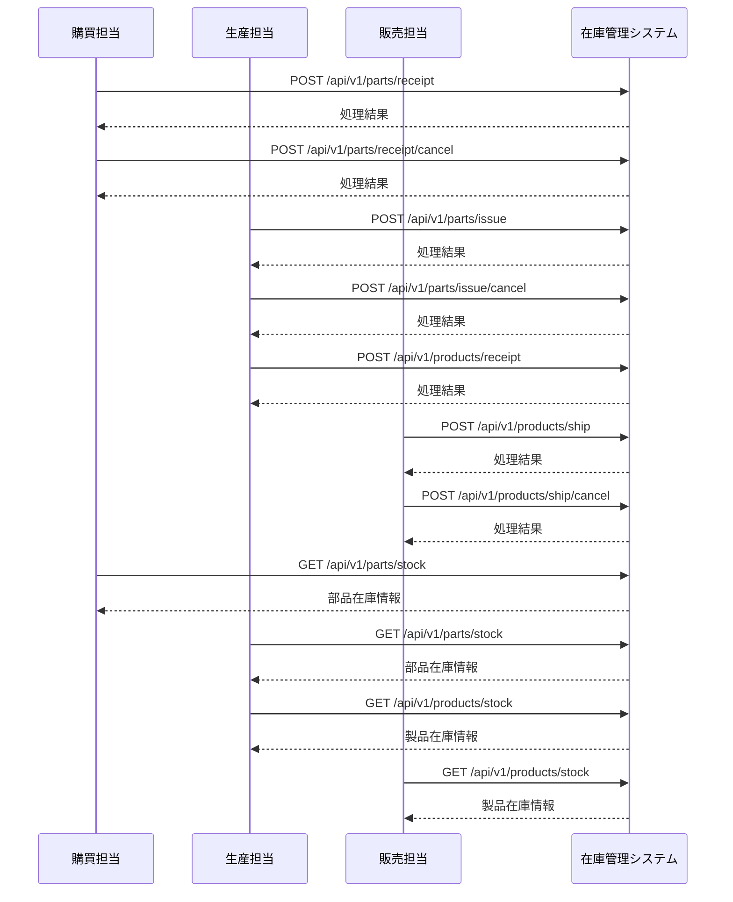

# ドローン在庫管理システム インターフェース設計書

## 📋 文書概要

| 項目       | 内容                                            |
| ---------- | ----------------------------------------------- |
| 文書名     | ドローン在庫管理システム インターフェース設計書 |
| 作成日     | 2024 年 12 月 15 日                             |
| 最終更新日 | 2024 年 12 月 15 日                             |
| バージョン | 1.1.0                                           |
| 作成者     | Development Team                                |
| 承認者     | System Architect                                |

## 🎯 対象読者

- システムアーキテクト
- バックエンド開発チーム
- 外部システム連携担当
- システムインテグレーター

---

## 1. インターフェース設計概要

### 1.1 設計方針

#### 1.1.1 基本原則

- **REST API**: HTTP/HTTPS ベースの標準的な REST API を採用
- **JSON 形式**: データ交換は JSON 形式を標準とする
- **同期処理**: リアルタイム在庫更新のため同期 API 方式を採用
- **べき等性**: 重複処理への対応（冪等キーによる重複排除）
- **エラーハンドリング**: 標準的な HTTP ステータスコードとエラーレスポンス

#### 1.1.2 API 設計ガイドライン

- **エンドポイント命名**: RESTful な命名規則（複数形リソース名）
- **HTTP メソッド**: GET（参照）、POST（作成）
- **レスポンス統一**: 成功・エラー共に統一されたレスポンス形式
- **バージョニング**: URL パスによる API バージョン管理（/api/v1/）

### 1.2 外部システム連携概要

#### 1.2.1 連携対象システム

| システム名   | 連携方向 | 主要データ                           | 更新頻度     |
| ------------ | -------- | ------------------------------------ | ------------ |
| **購買担当** | 双方向   | 部品入荷情報、入荷取消情報、在庫情報 | リアルタイム |
| **生産担当** | 双方向   | 生産指示、製品入庫情報、在庫情報     | リアルタイム |
| **販売担当** | 双方向   | 製品出荷情報、出荷取消情報、在庫情報 | リアルタイム |

#### 1.2.2 在庫管理基本フロー対応

業務要件書の在庫管理基本フローに基づく API 連携：



---

## 2. 部品在庫管理 API

### 2.1 部品入荷情報受信 API

#### 2.1.1 API 概要

購買担当から部品の入荷情報を受信し、部品在庫を更新します。

- **エンドポイント**: `POST /api/v1/parts/receipt`
- **認証**: JWT Bearer Token
- **権限**: ADMIN, OPERATOR

#### 2.1.2 リクエスト仕様

**HTTP ヘッダー**

```http
Content-Type: application/json
Authorization: Bearer <JWT_TOKEN>
X-Idempotency-Key: <UNIQUE_KEY>
```

**リクエストボディ**

```json
{
  "receipt_id": "RCP-2024-001234",
  "receipt_date": "2024-12-15T10:30:00Z",
  "center_code": "CTR001",
  "items": [
    {
      "stock_code": "PRT-FRAME-001",
      "stock_name": "ドローンフレーム（カーボン製）",
      "category_code": "CAT-FRAME",
      "received_quantity": 50,
      "unit": "個",
      "unit_cost": 15000,
      "lot_number": "LOT-2024-1215-001",
      "supplier_code": "SUP001",
      "supplier_name": "部品サプライヤー株式会社",
      "part_number": "FRAME-CB-001",
      "manufacturer": "カーボンテック株式会社",
      "expiry_date": "2026-12-15",
      "remarks": "品質検査済"
    }
  ],
  "operator": "purchase_user_001",
  "remarks": "年末在庫補充分"
}
```

#### 2.1.3 レスポンス仕様

**成功レスポンス（200 OK）**

```json
{
  "status": "success",
  "message": "部品入荷処理が正常に完了しました",
  "data": {
    "receipt_id": "RCP-2024-001234",
    "processed_at": "2024-12-15T10:30:15Z",
    "processed_items": [
      {
        "stock_code": "PRT-FRAME-001",
        "before_stock": 25,
        "after_stock": 75,
        "processed_quantity": 50,
        "status": "success"
      }
    ]
  }
}
```

#### 2.1.4 処理仕様（TODO: 詳細設計書に移動）

**処理フロー:**

1. **入力値検証**

   - 必須項目チェック（receipt_id, center_code, items など）
   - center_code の存在チェック（center_infos テーブル）
   - category_code の存在チェック（parts_categories テーブル）

2. **部品在庫の処理**

   - `parts_stock` テーブルで `stock_code` による検索
   - **既存レコードがある場合:**
     - `current_stock` を `received_quantity` 分加算
     - `unit_cost`, `last_receipt_date` などを更新
   - **既存レコードがない場合:**
     - 新規レコードを作成
     - `center_code` → `center_id` に変換
     - `category_code` → `category_id` に変換
     - `current_stock` = `received_quantity` で初期化

3. **履歴の記録**

   - `parts_warehouse_history` テーブルに入荷履歴を記録
   - `operation_type` = 'RECEIPT'
   - `reference_system` = 'PURCHASE'
   - `quantity_change` = `received_quantity` (正の値)

4. **冪等性の確保**
   - `X-Idempotency-Key` による重複処理防止

### 2.2 部品入荷取消 API

#### 2.2.1 API 概要

購買キャンセル時の入荷取消処理を行います。

- **エンドポイント**: `POST /api/v1/parts/receipt/cancel`
- **認証**: JWT Bearer Token
- **権限**: ADMIN, OPERATOR

#### 2.2.2 リクエスト仕様

```json
{
  "cancel_id": "CAN-2024-001234",
  "original_receipt_id": "RCP-2024-001234",
  "cancel_date": "2024-12-15T15:30:00Z",
  "cancel_reason": "発注キャンセルのため",
  "items": [
    {
      "stock_code": "PRT-FRAME-001",
      "cancel_quantity": 50
    }
  ],
  "operator": "purchase_user_001"
}
```

### 2.3 部品出庫（生産指示）API

#### 2.3.1 API 概要

生産担当からの製造指示を受信し、必要部品を出庫します。

- **エンドポイント**: `POST /api/v1/parts/issue`
- **認証**: JWT Bearer Token
- **権限**: ADMIN, OPERATOR

#### 2.3.2 リクエスト仕様

```json
{
  "production_order_id": "PO-2024-005678",
  "production_date": "2024-12-15T08:00:00Z",
  "product_code": "DRONE-AGRI-001",
  "production_quantity": 10,
  "center_code": "CTR001",
  "items": [
    {
      "stock_code": "PRT-FRAME-001",
      "required_quantity": 10,
      "manufacturing_lot": "LOT-PROD-2024-1215-001"
    },
    {
      "stock_code": "PRT-MOTOR-001",
      "required_quantity": 40,
      "manufacturing_lot": "LOT-PROD-2024-1215-001"
    }
  ],
  "operator": "production_user_001"
}
```

### 2.4 部品出庫取消 API

#### 2.4.1 API 概要

製造計画変更・中止時の部品在庫復旧処理を行います。

- **エンドポイント**: `POST /api/v1/parts/issue/cancel`
- **認証**: JWT Bearer Token
- **権限**: ADMIN, OPERATOR

#### 2.4.2 リクエスト仕様

```json
{
  "cancel_id": "PC-CAN-2024-005678",
  "original_production_order_id": "PO-2024-005678",
  "cancel_date": "2024-12-15T16:00:00Z",
  "cancel_reason": "設計変更のため製造中止",
  "items": [
    {
      "stock_code": "PRT-FRAME-001",
      "restore_quantity": 5
    }
  ],
  "operator": "production_user_001"
}
```

### 2.5 部品在庫情報取得 API

#### 2.5.1 API 概要

部品在庫情報を取得します。

- **エンドポイント**: `GET /api/v1/parts/stock`
- **認証**: JWT Bearer Token
- **権限**: ADMIN, OPERATOR, VIEWER

#### 2.5.2 リクエストパラメータ

```
GET /api/v1/parts/stock?center_code=CTR001&category_code=CAT-FRAME&stock_code=PRT-FRAME-001
```

#### 2.5.3 レスポンス仕様

```json
{
  "status": "success",
  "data": [
    {
      "stock_code": "PRT-FRAME-001",
      "stock_name": "ドローンフレーム（カーボン製）",
      "category_name": "フレーム",
      "center_name": "メインセンター",
      "current_stock": 75,
      "safety_stock": 50,
      "max_stock": 200,
      "unit": "個",
      "unit_cost": 15000,
      "alert_status": "NORMAL"
    }
  ]
}
```

---

## 3. 製品在庫管理 API

### 3.1 製品入庫（製造完了）API

#### 3.1.1 API 概要

製造完了・品質検査合格後の製品入庫処理を行います。

- **エンドポイント**: `POST /api/v1/products/receipt`
- **認証**: JWT Bearer Token
- **権限**: ADMIN, OPERATOR

#### 3.1.2 リクエスト仕様

```json
{
  "production_completion_id": "PC-2024-005678",
  "completion_date": "2024-12-15T18:00:00Z",
  "production_order_id": "PO-2024-005678",
  "stock_code": "DRONE-AGRI-001",
  "stock_name": "農業用ドローン（標準仕様）",
  "category_code": "CAT-AGRI",
  "completed_quantity": 10,
  "passed_quantity": 10,
  "center_code": "CTR001",
  "unit": "台",
  "unit_cost": 400000,
  "product_model": "AGRI-STD-V1",
  "product_version": "1.0",
  "weight_kg": 2.5,
  "quality_check": {
    "inspector": "qc_user_001",
    "inspection_date": "2024-12-15T17:30:00Z",
    "inspection_result": "PASS"
  },
  "manufacturing_lot": "LOT-PROD-2024-1215-001",
  "serial_numbers": ["DRN-AGRI-240001", "DRN-AGRI-240002"],
  "operator": "production_user_001"
}
```

### 3.2 製品出荷 API

#### 3.2.1 API 概要

販売担当からの出荷指示を受信し、製品在庫を減算します。

- **エンドポイント**: `POST /api/v1/products/ship`
- **認証**: JWT Bearer Token
- **権限**: ADMIN, OPERATOR

#### 3.2.2 リクエスト仕様

```json
{
  "shipment_id": "SHIP-2024-007890",
  "shipment_date": "2024-12-15T14:00:00Z",
  "customer_code": "CUST001",
  "center_code": "CTR001",
  "items": [
    {
      "stock_code": "DRONE-AGRI-001",
      "shipment_quantity": 3,
      "unit_price": 450000
    }
  ],
  "operator": "sales_user_001"
}
```

### 3.3 製品出荷取消 API

#### 3.3.1 API 概要

出荷キャンセル時の製品在庫復旧処理を行います。

- **エンドポイント**: `POST /api/v1/products/ship/cancel`
- **認証**: JWT Bearer Token
- **権限**: ADMIN, OPERATOR

#### 3.3.2 リクエスト仕様

```json
{
  "cancel_id": "SHIP-CAN-2024-007890",
  "original_shipment_id": "SHIP-2024-007890",
  "cancel_date": "2024-12-15T16:30:00Z",
  "cancel_reason": "顧客都合によるキャンセル",
  "items": [
    {
      "stock_code": "DRONE-AGRI-001",
      "cancel_quantity": 3
    }
  ],
  "operator": "sales_user_001"
}
```

### 3.4 製品在庫情報取得 API

#### 3.4.1 API 概要

製品在庫情報を取得します。

- **エンドポイント**: `GET /api/v1/products/stock`
- **認証**: JWT Bearer Token
- **権限**: ADMIN, OPERATOR, VIEWER

#### 3.4.2 リクエストパラメータ

```
GET /api/v1/products/stock?center_code=CTR001&category_code=CAT-AGRI&stock_code=DRONE-AGRI-001
```

#### 3.4.3 レスポンス仕様

```json
{
  "status": "success",
  "data": [
    {
      "stock_code": "DRONE-AGRI-001",
      "stock_name": "農業用ドローン（標準仕様）",
      "category_name": "農業用",
      "center_name": "メインセンター",
      "current_stock": 22,
      "safety_stock": 10,
      "max_stock": 50,
      "unit": "台",
      "unit_cost": 400000,
      "alert_status": "NORMAL"
    }
  ]
}
```

---

## 4. 共通エラーハンドリング

### 4.1 エラーコード定義

| エラーコード         | HTTP ステータス | 説明               |
| -------------------- | --------------- | ------------------ |
| `SUCCESS`            | 200             | 正常処理完了       |
| `INVALID_REQUEST`    | 400             | リクエスト形式不正 |
| `UNAUTHORIZED`       | 401             | 認証エラー         |
| `FORBIDDEN`          | 403             | 権限不足           |
| `RESOURCE_NOT_FOUND` | 404             | リソース未存在     |
| `DUPLICATE_REQUEST`  | 409             | 重複リクエスト     |
| `INSUFFICIENT_STOCK` | 422             | 在庫不足           |
| `INTERNAL_ERROR`     | 500             | システム内部エラー |

### 4.2 エラーレスポンス統一形式

```json
{
  "status": "error",
  "message": "エラーの概要説明",
  "error_code": "ERROR_CODE",
  "details": "詳細なエラー内容",
  "timestamp": "2024-12-15T10:30:15Z"
}
```

### 4.3 エラーレスポンス例

#### 4.3.1 在庫不足エラー（422）

```json
{
  "status": "error",
  "message": "在庫不足のため出庫できません",
  "error_code": "INSUFFICIENT_STOCK",
  "details": "stock_code: PRT-FRAME-001 の現在在庫: 5個、要求数量: 10個",
  "timestamp": "2024-12-15T10:30:15Z"
}
```

#### 4.3.2 リソース未存在エラー（404）

```json
{
  "status": "error",
  "message": "指定されたリソースが見つかりません",
  "error_code": "RESOURCE_NOT_FOUND",
  "details": "center_code: CTR999 は存在しません",
  "timestamp": "2024-12-15T10:30:15Z"
}
```

#### 4.3.3 入力値不正エラー（400）

```json
{
  "status": "error",
  "message": "リクエスト形式が不正です",
  "error_code": "INVALID_REQUEST",
  "details": "required field 'stock_name' is missing",
  "timestamp": "2024-12-15T10:30:15Z"
}
```

---

## 5. セキュリティ要件

### 5.1 認証・認可

#### 5.1.1 JWT 認証

- **トークン有効期限**: 24 時間
- **署名アルゴリズム**: RS256

#### 5.1.2 権限レベル

| 権限レベル | 実行可能操作                                       |
| ---------- | -------------------------------------------------- |
| ADMIN      | 全操作可能                                         |
| OPERATOR   | 在庫更新操作（入荷・出庫・入庫・出荷・キャンセル） |
| VIEWER     | 在庫情報参照のみ                                   |

### 5.2 通信セキュリティ

- **TLS バージョン**: 1.2 以上
- **API セキュリティ**: Rate Limiting（1 分間に 60 リクエスト）
- **入力値検証**: 厳密なバリデーション実装

---

## 6. 運用・監視

### 6.1 ヘルスチェック

- **エンドポイント**: `GET /api/v1/health`
- **レスポンス**:

```json
{
  "status": "UP",
  "components": {
    "database": {
      "status": "UP"
    }
  },
  "timestamp": "2024-12-15T10:30:15Z"
}
```

### 6.2 API 監視項目

- **応答時間**: 平均・最大応答時間
- **エラー率**: 4xx・5xx エラーの発生率
- **在庫整合性**: API 処理前後の在庫数チェック

---

## 📋 承認履歴

| バージョン | 更新日     | 更新者           | 承認者           | 更新内容                                      |
| ---------- | ---------- | ---------------- | ---------------- | --------------------------------------------- |
| 1.0.0      | 2024-12-15 | Development Team | System Architect | 業務要件基本フローに基づく API 連携の初版作成 |
| 1.1.0      | 2024-12-15 | Development Team | System Architect | テーブル設計に基づくリクエスト Body の詳細化  |

---

## 📚 関連ドキュメント

- [業務要件書](../../../docs/requirements/business-requirements.md)
- [データ設計書](../../../docs/architecture/data-design.md)
- [システム概要書](./system-overview.md)
