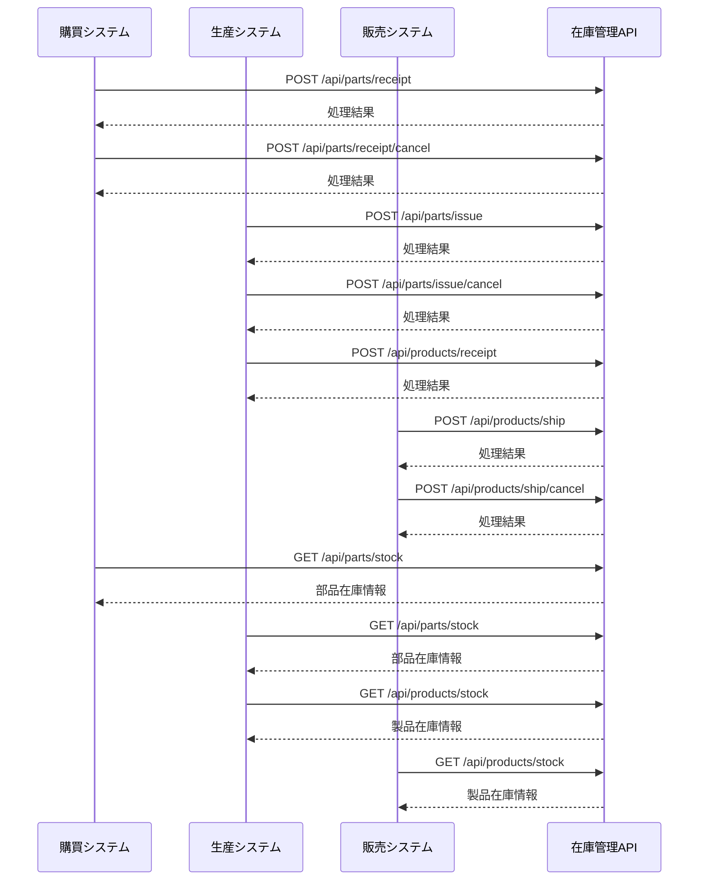

# ドローン在庫管理システム インターフェース仕様書

## 📋 文書概要

| 項目       | 内容                                            |
| ---------- | ----------------------------------------------- |
| 文書名     | ドローン在庫管理システム インターフェース設計書 |
| 作成日     | 2024 年 12 月 15 日                             |
| 最終更新日 | 2024 年 12 月 15 日                             |
| バージョン | 2.0.0                                           |
| 作成者     | Development Team                                |
| 承認者     | System Architect                                |

## 🎯 対象読者

- システムアーキテクト
- バックエンド開発チーム
- 外部システム連携担当
- システムインテグレーター

---

## 1. インターフェース設計概要

### 1.1 設計方針

#### 1.1.1 基本原則

- **REST API**: HTTP/HTTPS ベースの標準的な REST API を採用
- **JSON 形式**: データ交換は JSON 形式を標準とする
- **同期処理**: リアルタイム在庫更新のため同期 API 方式を採用
- **べき等性**: 重複処理への対応（冪等キーによる重複排除）
- **エラーハンドリング**: 標準的な HTTP ステータスコードとエラーレスポンス

#### 1.1.2 API 設計ガイドライン

- **エンドポイント命名**: RESTful な命名規則（複数形リソース名）
- **HTTP メソッド**: GET（参照）、POST（作成）
- **レスポンス統一**: 成功・エラー共に統一されたレスポンス形式
- **バージョニング**: URL パスによる API バージョン管理（/api/v1/）

### 1.2 外部システム連携概要

#### 1.2.1 連携対象システム

| システム名       | 連携方向 | 主要データ                           | 更新頻度     |
| ---------------- | -------- | ------------------------------------ | ------------ |
| **購買システム** | 双方向   | 部品入荷情報、入荷取消情報、在庫情報 | リアルタイム |
| **生産システム** | 双方向   | 生産指示、製品入庫情報、在庫情報     | リアルタイム |
| **販売システム** | 双方向   | 製品出荷情報、出荷取消情報、在庫情報 | リアルタイム |

#### 1.2.2 認証方式

**API キー認証** によるシステム間認証：

| システム         | 権限レベル   | 利用可能 API                           |
| ---------------- | ------------ | -------------------------------------- |
| **購買システム** | SYSTEM_BUYER | 部品入荷、入荷取消、部品在庫照会       |
| **生産システム** | SYSTEM_PROD  | 部品出庫、出庫取消、製品入庫、在庫照会 |
| **販売システム** | SYSTEM_SALES | 製品出荷、出荷キャンセル、製品在庫照会 |

#### 1.2.3 在庫管理基本フロー対応

業務要件書の在庫管理基本フローに基づく API 連携：



---

## 2. 部品在庫管理 API

### 2.1 部品入荷情報受信 API

#### 2.1.1 API 概要

購買システムから部品の入荷情報を受信し、部品在庫を更新します。

- **エンドポイント**: `POST /api/parts/receipt`
- **認証**: API キー認証
- **権限**: SYSTEM_BUYER

#### 2.1.2 リクエスト仕様

**HTTP ヘッダー**

```http
Content-Type: application/json
X-API-Key: <SYSTEM_API_KEY>
X-System-ID: PURCHASE_SYSTEM
X-Idempotency-Key: <UNIQUE_KEY>
```

**リクエストボディ**

```json
{
  "receipt_id": "RCP-2024-001234",
  "receipt_date": "2024-12-15T10:30:00Z",
  "center_id": 1,
  "items": [
    {
      "stock_id": 1,
      "name": "ドローンフレーム（カーボン製）",
      "category_id": 1,
      "received_quantity": 50,
      "lot_number": "LOT-2024-1215-001",
      "supplier_info": "部品サプライヤー株式会社",
      "remarks": "品質検査済"
    }
  ],
  "operator": "purchase_user_001",
  "remarks": "年末在庫補充分"
}
```

#### 2.1.3 レスポンス仕様

**成功レスポンス（200 OK）**

```json
{
  "status": "success",
  "message": "部品入荷処理が正常に完了しました",
  "data": {
    "receipt_id": "RCP-2024-001234",
    "processed_at": "2024-12-15T10:30:15Z",
    "processed_items": [
      {
        "stock_id": 1,
        "name": "ドローンフレーム（カーボン製）",
        "before_amount": 25,
        "after_amount": 75,
        "processed_quantity": 50,
        "status": "success"
      }
    ]
  }
}
```

### 2.2 部品入荷取消 API

#### 2.2.1 API 概要

購買キャンセル時の入荷取消処理を行います。

- **エンドポイント**: `POST /api/parts/receipt/cancel`
- **認証**: API キー認証
- **権限**: SYSTEM_BUYER

#### 2.2.2 リクエスト仕様

**HTTP ヘッダー**

```http
Content-Type: application/json
X-API-Key: <SYSTEM_API_KEY>
X-System-ID: PURCHASE_SYSTEM
X-Idempotency-Key: <UNIQUE_KEY>
```

**リクエストボディ**

```json
{
  "cancel_id": "CAN-2024-001234",
  "original_receipt_id": "RCP-2024-001234",
  "cancel_date": "2024-12-15T15:30:00Z",
  "cancel_reason": "発注キャンセルのため",
  "items": [
    {
      "stock_id": 1,
      "cancel_quantity": 50
    }
  ],
  "operator": "purchase_user_001"
}
```

#### 2.2.3 レスポンス仕様

**成功レスポンス（200 OK）**

```json
{
  "status": "success",
  "message": "部品入荷取消処理が正常に完了しました",
  "data": {
    "cancel_id": "CAN-2024-001234",
    "original_receipt_id": "RCP-2024-001234",
    "processed_at": "2024-12-15T15:30:15Z",
    "processed_items": [
      {
        "stock_id": 1,
        "name": "ドローンフレーム（カーボン製）",
        "before_amount": 75,
        "after_amount": 25,
        "cancelled_quantity": 50,
        "status": "success"
      }
    ]
  }
}
```

### 2.3 部品出庫（生産指示）API

#### 2.3.1 API 概要

生産システムからの製造指示を受信し、必要部品を出庫します。

- **エンドポイント**: `POST /api/parts/issue`
- **認証**: API キー認証
- **権限**: SYSTEM_PROD

#### 2.3.2 リクエスト仕様

**HTTP ヘッダー**

```http
Content-Type: application/json
X-API-Key: <SYSTEM_API_KEY>
X-System-ID: PRODUCTION_SYSTEM
X-Idempotency-Key: <UNIQUE_KEY>
```

**リクエストボディ**

```json
{
  "production_order_id": "PO-2024-005678",
  "production_date": "2024-12-15T08:00:00Z",
  "product_stock_id": 1,
  "production_quantity": 10,
  "center_id": 1,
  "items": [
    {
      "stock_id": 1,
      "required_quantity": 10,
      "manufacturing_lot": "LOT-PROD-2024-1215-001"
    },
    {
      "stock_id": 2,
      "required_quantity": 40,
      "manufacturing_lot": "LOT-PROD-2024-1215-001"
    }
  ],
  "operator": "production_user_001"
}
```

#### 2.3.3 レスポンス仕様

**成功レスポンス（200 OK）**

```json
{
  "status": "success",
  "message": "部品出庫処理が正常に完了しました",
  "data": {
    "production_order_id": "PO-2024-005678",
    "processed_at": "2024-12-15T08:00:15Z",
    "processed_items": [
      {
        "stock_id": 1,
        "name": "ドローンフレーム（カーボン製）",
        "before_amount": 75,
        "after_amount": 65,
        "issued_quantity": 10,
        "status": "success"
      },
      {
        "stock_id": 2,
        "name": "プロペラ（4枚セット）",
        "before_amount": 200,
        "after_amount": 160,
        "issued_quantity": 40,
        "status": "success"
      }
    ]
  }
}
```

### 2.4 部品出庫取消 API

#### 2.4.1 API 概要

製造計画変更・中止時の部品在庫復旧処理を行います。

- **エンドポイント**: `POST /api/parts/issue/cancel`
- **認証**: API キー認証
- **権限**: SYSTEM_PROD

#### 2.4.2 リクエスト仕様

**HTTP ヘッダー**

```http
Content-Type: application/json
X-API-Key: <SYSTEM_API_KEY>
X-System-ID: PRODUCTION_SYSTEM
X-Idempotency-Key: <UNIQUE_KEY>
```

**リクエストボディ**

```json
{
  "cancel_id": "PC-CAN-2024-005678",
  "original_production_order_id": "PO-2024-005678",
  "cancel_date": "2024-12-15T16:00:00Z",
  "cancel_reason": "設計変更のため製造中止",
  "items": [
    {
      "stock_id": 1,
      "restore_quantity": 5
    }
  ],
  "operator": "production_user_001"
}
```

#### 2.4.3 レスポンス仕様

**成功レスポンス（200 OK）**

```json
{
  "status": "success",
  "message": "部品出庫取消処理が正常に完了しました",
  "data": {
    "cancel_id": "PC-CAN-2024-005678",
    "original_production_order_id": "PO-2024-005678",
    "processed_at": "2024-12-15T16:00:15Z",
    "processed_items": [
      {
        "stock_id": 1,
        "name": "ドローンフレーム（カーボン製）",
        "before_amount": 65,
        "after_amount": 70,
        "restored_quantity": 5,
        "status": "success"
      }
    ]
  }
}
```

### 2.5 部品在庫情報取得 API

#### 2.5.1 API 概要

部品在庫情報を取得します。

- **エンドポイント**: `GET /api/parts/stock`
- **認証**: API キー認証
- **権限**: SYSTEM_BUYER, SYSTEM_PROD

#### 2.5.2 リクエスト仕様

**HTTP ヘッダー**

```http
X-API-Key: <SYSTEM_API_KEY>
X-System-ID: <PURCHASE_SYSTEM|PRODUCTION_SYSTEM>
```

**クエリパラメータ**

```
GET /api/parts/stock?center_id=1&category_id=1&stock_id=1
```

| パラメータ  | 型     | 必須 | 説明                    |
| ----------- | ------ | ---- | ----------------------- |
| center_id   | number | ×    | センター ID（絞り込み） |
| category_id | number | ×    | カテゴリ ID（絞り込み） |
| stock_id    | number | ×    | 在庫 ID（特定在庫取得） |

#### 2.5.3 レスポンス仕様

```json
{
  "status": "success",
  "data": [
    {
      "stock_id": 1,
      "name": "ドローンフレーム（カーボン製）",
      "category_id": 1,
      "category_name": "フレーム",
      "center_id": 1,
      "center_name": "メインセンター",
      "amount": 75,
      "description": "カーボン製のドローンフレーム",
      "create_date": "2024-12-15T10:30:15Z",
      "update_date": "2024-12-15T14:20:30Z"
    }
  ]
}
```

---

## 3. 製品在庫管理 API

### 3.1 製品入庫（製造完了）API

#### 3.1.1 API 概要

製造完了・品質検査合格後の製品入庫処理を行います。

- **エンドポイント**: `POST /api/products/receipt`
- **認証**: API キー認証
- **権限**: SYSTEM_PROD

#### 3.1.2 リクエスト仕様

**HTTP ヘッダー**

```http
Content-Type: application/json
X-API-Key: <SYSTEM_API_KEY>
X-System-ID: PRODUCTION_SYSTEM
X-Idempotency-Key: <UNIQUE_KEY>
```

**リクエストボディ**

```json
{
  "production_completion_id": "PC-2024-005678",
  "completion_date": "2024-12-15T18:00:00Z",
  "production_order_id": "PO-2024-005678",
  "stock_id": 1,
  "name": "農業用ドローン（標準仕様）",
  "category_id": 1,
  "completed_quantity": 10,
  "passed_quantity": 10,
  "center_id": 1,
  "description": "農業用ドローン（標準仕様）",
  "manufacturing_lot": "LOT-PROD-2024-1215-001",
  "operator": "production_user_001"
}
```

#### 3.1.3 レスポンス仕様

**成功レスポンス（200 OK）**

```json
{
  "status": "success",
  "message": "製品入庫処理が正常に完了しました",
  "data": {
    "production_completion_id": "PC-2024-005678",
    "production_order_id": "PO-2024-005678",
    "processed_at": "2024-12-15T18:00:15Z",
    "processed_items": [
      {
        "stock_id": 1,
        "name": "農業用ドローン（標準仕様）",
        "before_amount": 12,
        "after_amount": 22,
        "received_quantity": 10,
        "manufacturing_lot": "LOT-PROD-2024-1215-001",
        "status": "success"
      }
    ]
  }
}
```

### 3.2 製品出荷 API

#### 3.2.1 API 概要

販売システムからの出荷指示を受信し、製品在庫を減算します。

- **エンドポイント**: `POST /api/products/ship`
- **認証**: API キー認証
- **権限**: SYSTEM_SALES

#### 3.2.2 リクエスト仕様

**HTTP ヘッダー**

```http
Content-Type: application/json
X-API-Key: <SYSTEM_API_KEY>
X-System-ID: SALES_SYSTEM
X-Idempotency-Key: <UNIQUE_KEY>
```

**リクエストボディ**

```json
{
  "shipment_id": "SHIP-2024-007890",
  "shipment_date": "2024-12-15T14:00:00Z",
  "customer_info": "顧客情報株式会社",
  "center_id": 1,
  "items": [
    {
      "stock_id": 1,
      "shipment_quantity": 3
    }
  ],
  "operator": "sales_user_001"
}
```

#### 3.2.3 レスポンス仕様

**成功レスポンス（200 OK）**

```json
{
  "status": "success",
  "message": "製品出荷処理が正常に完了しました",
  "data": {
    "shipment_id": "SHIP-2024-007890",
    "processed_at": "2024-12-15T14:00:15Z",
    "processed_items": [
      {
        "stock_id": 1,
        "name": "農業用ドローン（標準仕様）",
        "before_amount": 22,
        "after_amount": 19,
        "shipped_quantity": 3,
        "customer_info": "顧客情報株式会社",
        "status": "success"
      }
    ]
  }
}
```

### 3.3 製品出荷取消 API

#### 3.3.1 API 概要

出荷キャンセル時の製品在庫復旧処理を行います。

- **エンドポイント**: `POST /api/products/ship/cancel`
- **認証**: API キー認証
- **権限**: SYSTEM_SALES

#### 3.3.2 リクエスト仕様

**HTTP ヘッダー**

```http
Content-Type: application/json
X-API-Key: <SYSTEM_API_KEY>
X-System-ID: SALES_SYSTEM
X-Idempotency-Key: <UNIQUE_KEY>
```

**リクエストボディ**

```json
{
  "cancel_id": "SHIP-CAN-2024-007890",
  "original_shipment_id": "SHIP-2024-007890",
  "cancel_date": "2024-12-15T16:30:00Z",
  "cancel_reason": "顧客都合によるキャンセル",
  "items": [
    {
      "stock_id": 1,
      "cancel_quantity": 3
    }
  ],
  "operator": "sales_user_001"
}
```

#### 3.3.3 レスポンス仕様

**成功レスポンス（200 OK）**

```json
{
  "status": "success",
  "message": "製品出荷取消処理が正常に完了しました",
  "data": {
    "cancel_id": "SHIP-CAN-2024-007890",
    "original_shipment_id": "SHIP-2024-007890",
    "processed_at": "2024-12-15T16:30:15Z",
    "processed_items": [
      {
        "stock_id": 1,
        "name": "農業用ドローン（標準仕様）",
        "before_amount": 19,
        "after_amount": 22,
        "restored_quantity": 3,
        "status": "success"
      }
    ]
  }
}
```

### 3.4 製品在庫情報取得 API

#### 3.4.1 API 概要

製品在庫情報を取得します。

- **エンドポイント**: `GET /api/products/stock`
- **認証**: API キー認証
- **権限**: SYSTEM_PROD, SYSTEM_SALES

#### 3.4.2 リクエスト仕様

**HTTP ヘッダー**

```http
X-API-Key: <SYSTEM_API_KEY>
X-System-ID: <PRODUCTION_SYSTEM|SALES_SYSTEM>
```

**クエリパラメータ**

```
GET /api/products/stock?center_id=1&category_id=1&stock_id=1
```

| パラメータ  | 型     | 必須 | 説明                    |
| ----------- | ------ | ---- | ----------------------- |
| center_id   | number | ×    | センター ID（絞り込み） |
| category_id | number | ×    | カテゴリ ID（絞り込み） |
| stock_id    | number | ×    | 在庫 ID（特定在庫取得） |

#### 3.4.3 レスポンス仕様

```json
{
  "status": "success",
  "data": [
    {
      "stock_id": 1,
      "name": "農業用ドローン（標準仕様）",
      "category_id": 1,
      "category_name": "農業用",
      "center_id": 1,
      "center_name": "メインセンター",
      "amount": 22,
      "description": "農業用ドローン（標準仕様）",
      "create_date": "2024-12-15T10:30:15Z",
      "update_date": "2024-12-15T14:20:30Z"
    }
  ]
}
```

---

## 4. 共通エラーハンドリング

### 4.1 エラーコード定義

| エラーコード         | HTTP ステータス | 説明               |
| -------------------- | --------------- | ------------------ |
| `SUCCESS`            | 200             | 正常処理完了       |
| `INVALID_REQUEST`    | 400             | リクエスト形式不正 |
| `UNAUTHORIZED`       | 401             | 認証エラー         |
| `FORBIDDEN`          | 403             | 権限不足           |
| `RESOURCE_NOT_FOUND` | 404             | リソース未存在     |
| `DUPLICATE_REQUEST`  | 409             | 重複リクエスト     |
| `INSUFFICIENT_STOCK` | 422             | 在庫不足           |
| `INTERNAL_ERROR`     | 500             | システム内部エラー |

### 4.2 エラーレスポンス統一形式

```json
{
  "status": "error",
  "message": "エラーの概要説明",
  "error_code": "ERROR_CODE",
  "details": "詳細なエラー内容",
  "timestamp": "2024-12-15T10:30:15Z"
}
```

### 4.3 エラーレスポンス例

#### 4.3.1 在庫不足エラー（422）

```json
{
  "status": "error",
  "message": "在庫不足のため出庫できません",
  "error_code": "INSUFFICIENT_STOCK",
  "details": "stock_id: 1 の現在在庫: 5個、要求数量: 10個",
  "timestamp": "2024-12-15T10:30:15Z"
}
```

#### 4.3.2 認証エラー（401）

```json
{
  "status": "error",
  "message": "認証に失敗しました",
  "error_code": "UNAUTHORIZED",
  "details": "無効なAPIキーです",
  "timestamp": "2024-12-15T10:30:15Z"
}
```

#### 4.3.3 権限不足エラー（403）

```json
{
  "status": "error",
  "message": "操作権限がありません",
  "error_code": "FORBIDDEN",
  "details": "SYSTEM_BUYER権限では製品出荷APIは利用できません",
  "timestamp": "2024-12-15T10:30:15Z"
}
```

#### 4.3.4 入力値不正エラー（400）

```json
{
  "status": "error",
  "message": "リクエスト形式が不正です",
  "error_code": "INVALID_REQUEST",
  "details": "required field 'receipt_id' is missing",
  "timestamp": "2024-12-15T10:30:15Z"
}
```

---

## 5. セキュリティ要件

### 5.1 認証・認可

#### 5.1.1 API キー認証

- **システム別固有キー**: 各外部システムに固有の API キーを発行
- **キーローテーション**: セキュリティ強化のための定期的キー更新
- **権限制御**: システム権限に基づく機能制限

#### 5.1.2 システム権限レベル

| 権限レベル   | 対象システム | 実行可能操作                           |
| ------------ | ------------ | -------------------------------------- |
| SYSTEM_BUYER | 購買システム | 部品入荷、入荷取消、部品在庫照会       |
| SYSTEM_PROD  | 生産システム | 部品出庫、出庫取消、製品入庫、在庫照会 |
| SYSTEM_SALES | 販売システム | 製品出荷、出荷キャンセル、製品在庫照会 |

### 5.2 通信セキュリティ

- **TLS バージョン**: 1.2 以上
- **IP 制限**: 許可された外部システム IP からのアクセスのみ
- **レート制限**: システム別アクセス頻度制限（60req/min）
- **入力値検証**: 厳密なバリデーション実装

### 5.3 監査・ログ

- **API 呼び出しログ**: 全リクエストの記録
- **操作履歴**: 在庫変動の詳細ログ
- **セキュリティログ**: 認証失敗・不正アクセス記録

---

## 📋 承認履歴

| バージョン | 更新日     | 更新者           | 承認者           | 更新内容                                       |
| ---------- | ---------- | ---------------- | ---------------- | ---------------------------------------------- |
| 1.0.0      | 2024-12-15 | Development Team | System Architect | 業務要件基本フローに基づく API 連携の初版作成  |
| 1.1.0      | 2024-12-15 | Development Team | System Architect | テーブル設計に基づくリクエスト Body の詳細化   |
| 1.2.0      | 2024-12-15 | Development Team | System Architect | データ設計書との整合性確保（フィールド名統一） |
| 2.0.0      | 2024-12-15 | Development Team | System Architect | 外部システム連携専用設計・API キー認証対応     |

---

## 📚 関連ドキュメント

- [API 機能仕様書](./api-functional-specifications.md)
- [システム概要書](./system-overview.md)
- [業務要件書](../../../requirements/business-requirements.md)
- [データ設計書](../common/data-design.md)
