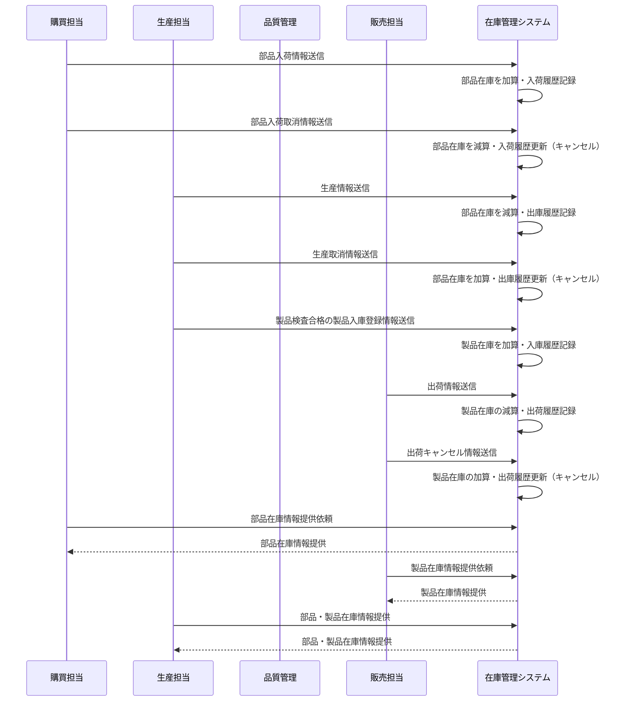

# ドローン在庫管理システム 業務要件書

## 文書概要

| 項目       | 内容                                |
| ---------- | ----------------------------------- |
| 文書名     | ドローン在庫管理システム 業務要件書 |
| 作成日     | 2024 年 12 月 15 日                 |
| 最終更新日 | 2024 年 12 月 15 日                 |
| バージョン | 1.0.0                               |
| 作成者     | Development Team                    |
| 承認者     | Project Manager                     |

## 対象

- プロジェクトマネージャー
- ビジネスアナリスト
- ステークホルダー
- 開発チーム

---

## 1. プロジェクト概要

### 1.1 プロジェクトの背景

クライアント企業（産業用ドローン製造業）では、以下の課題を抱えている：

#### 現状の課題

- **カスタマイズ要件の増加**: 各分野（インフラ、巡回、物流、農業、災害対策、セキュリティ）で異なるニーズ
- **従来システムの限界**: パッケージ型生産管理システムでは対応困難
- **カスタマイズコストの問題**: 既存パッケージのカスタマイズが高コスト
- **生産方式の変化**: プラットフォームベース＋追加部品によるカスタマイズ生産

#### 解決方針

独自のドローン生産システム開発による業務効率化とコスト削減

### 1.2 プロジェクトの目的

産業用ドローンの生産システム全体像のうち、**在庫管理システムを新規開発**し、以下を実現する：

1. **在庫の一元管理**: 部品と製品の在庫状況を統合的に管理
2. **カスタマイズ生産対応**: 多様な部品組み合わせによる製品製造をサポート
3. **製造プロセス最適化**: 効率的な製品製造計画 / 部品購買計画立案のための在庫情報提供
4. **コスト削減**: 在庫適正化による保管コストと欠品リスクの低減

### 1.3 クライアント企業概要

#### 基本情報

- **創業年**: 2016 年
- **業種**: 産業用ドローン製造・開発
- **事業領域**: インフラ点検、農業、物流、セキュリティ、災害対策
- **ミッション**: 「ドローンが空を飛び交い、さまざまな社会課題を解決し、人々の生活や社会を豊かにする」

#### 製品特徴

- **4 つのプロペラ**: 対角配置で安定性確保
- **高機能装備**: 高解像度カメラ、セキュリティ機能、高精度センサー、GPS 機能
- **カスタマイズ対応**: 分野別ニーズに応じた機能追加

#### 製品カテゴリ例

- **インフラ点検用**: 橋梁、建物、送電線等の点検・監視
- **農業用**: 農薬散布、作物監視、収穫量予測
- **物流用**: 荷物配送、在庫管理、輸送効率化
- **セキュリティ用**: 警備、監視、侵入検知
- **災害対策用**: 被災状況調査、救助支援、情報収集
- **測量用**: 地形測量、3D マッピング、土木工事支援

#### ドローン構成部品

- **フレーム**（ドローンの骨組み）
- **プロペラ**（通常 4 つ）
- **プロペラを駆動するための電動モーター**（基本４つ）
- **モーターの回転速度を制御するための電子速度調整器**
- **バッテリー**
- **フライトコントローラー**（ジャイロセンサーや加速度センサーを備えているドローンの中枢部品）
- **リモートコントローラー**
- **受信機**（リモコンから送られてきた信号を受信し、フライトコントローラーに送られる）
- **GPS モジュール**（自律飛行や位置保持機能）
- **カメラとセンサー**（映像撮影やセンシング機能を提供し、さまざまなアプリケーションに活用される）

### 1.4 システム概要

#### システム名

**ドローン在庫管理システム（DroneInventorySystem）**

#### システムの役割

部品と製品の在庫を一元管理し、ドローン製造プロセスを効率的にサポートする

---

## 2. 業務要件

### 2.1 業務プロセス

#### 2.1.1 在庫管理の基本フロー

#### 2.1.2 業務プロセス詳細

##### 2.1.2.1 部品の購買・入荷

- 購買担当者が部品を発注し、納品後に入荷処理を行う（検品・受領）
- 検品済かつ受領可能な数量のみ在庫に反映
- 入荷処理により在庫を加算し、「入荷履歴」に記録

##### 2.1.2.2 部品の購買キャンセル

- 購買担当者からの入荷取消情報を受信
- 対象の入荷履歴をキャンセル扱いに変更し、在庫数を減算

##### 2.1.2.3 製品製造計画の実行

- 生産担当者が製造計画に基づき使用部品情報を送信
- 必要部品を出庫し、在庫数を減算
- 「出庫履歴」に記録を保持

##### 2.1.2.4 製品製造計画のキャンセル

- 生産担当者からの製造取消情報を受信
- 使用済み部品を在庫へ復旧
- 出庫履歴はキャンセルとして更新

##### 2.1.2.5 製造完了・製品入庫

- 生産完了した製品を品質管理部門が検査
- 合格品のみ在庫として入庫され、「入庫履歴」に記録

##### 2.1.2.6 製品の出荷

- 販売担当者が出荷情報を送信
- 製品在庫を減算し、「出荷履歴」に記録

##### 2.1.2.7 製品の出荷キャンセル

- 販売担当者から出荷キャンセル情報を受信
- 出荷対象製品の在庫を復旧
- 出荷履歴をキャンセルとして更新

##### 2.1.2.8 在庫情報の提供

- 購買・生産・販売各システムに対し、以下の情報を必要に応じて提供
  - 部品在庫情報（購買・生産向け）
  - 製品在庫情報（生産・販売向け）

### 2.2 マスタ情報管理

#### 2.2.1 部品カテゴリ管理

##### 業務概要

- 部品を分類・体系化するためのカテゴリ情報を管理する
- 部品の検索・絞り込み・レポート作成を効率化する
- 購買システムとの連携により、カテゴリ情報の整合性を保持する

##### 主要機能

- **カテゴリ登録・編集**:
  - カテゴリ名、説明、分類コード等の基本情報管理
  - 階層構造による細分化対応可能
- **カテゴリ検索・参照**:
  - カテゴリ別部品一覧表示
  - 検索条件としてのカテゴリ指定機能
- **カテゴリ削除制限**:
  - 関連する部品が存在する場合は削除不可
  - 削除時は事前に影響範囲を表示し確認

##### 業務ルール

- 購買システムとのカテゴリ整合性維持
- カテゴリ変更時は関連部品への影響確認必須
- 削除は関連データ不存在時のみ実行可能

#### 2.2.2 製品カテゴリ管理

##### 業務概要

- 製品を分類・体系化するためのカテゴリ情報を管理する
- 製品の検索・絞り込み・売上分析を効率化する
- 生産管理システム・販売管理システムとの連携により整合性を保持する

##### 主要機能

- **カテゴリ登録・編集**:
  - カテゴリ名、説明、分類コード等の基本情報管理
  - 用途別（インフラ点検、農業、物流、セキュリティ、災害対策、測量）分類対応
- **カテゴリ検索・参照**:
  - カテゴリ別製品一覧表示
  - 売上分析・在庫分析時のカテゴリ軸対応
- **カテゴリ削除制限**:
  - 関連する製品が存在する場合は削除不可
  - 削除時は事前に影響範囲を表示し確認

##### 業務ルール

- 生産管理システム・販売管理システムとのカテゴリ整合性維持
- カテゴリ変更時は関連製品への影響確認必須
- 削除は関連データ不存在時のみ実行可能

#### 2.2.3 在庫センター情報管理

##### 業務概要

- 在庫を物理的に保管・管理する拠点情報を管理する
- センター別の在庫状況把握・分析を可能にする
- 拠点間の在庫移動・配送最適化をサポートする

##### 主要機能

- **センター登録・編集**:
  - センター名、住所、責任者、連絡先等の基本情報管理
  - 保管可能容量、取扱可能品目等の運用情報管理
- **センター検索・参照**:
  - センター一覧表示・詳細情報確認
  - センター別在庫状況・実績確認
- **センター削除制限**:
  - 関連する在庫データが存在する場合は削除不可
  - 削除時は事前に影響範囲を表示し確認

##### 業務ルール

- 各センターは独立した在庫管理単位として運用
- センター別の安全在庫・最大在庫レベル設定可能
- センター情報変更時は関連在庫データへの影響確認必須
- 削除は関連在庫データ不存在時のみ実行可能

## 2.3 ビジネスルール

## 2.3.1 基本原則

### データ整合性の原則

- すべての在庫変動は適切な履歴として記録されなければならない
- 外部システムとの連携においては、データの整合性を常に保持する
- システム間の情報は最新状態を維持し、不整合を防止する

### トレーサビリティの原則

- 部品から製品まで、すべての工程における追跡可能性を確保する
- 品質問題発生時に迅速な原因特定と影響範囲の把握を可能にする
- 監査・内部統制要件を満たすための証跡管理を行う

### セキュリティ・権限管理の原則

- 操作に応じた適切な権限レベルを設定する
- すべてのユーザー操作を記録し、責任の所在を明確にする
- 企業機密である在庫情報の適切な保護を行う

## 2.3.2 在庫管理ルール

### 在庫レベル管理

- **安全在庫**: 各センター・部品/製品ごとに個別設定可能
- **最大在庫**: 過剰在庫防止のため上限値を設定
- **欠品管理**: 在庫数がゼロの場合は「欠品」ステータスで管理
- **アラート条件**:
  - 安全在庫を下回った場合 → 発注推奨アラートを自動生成
  - 最大在庫を超える入庫時 → 過剰在庫警告を表示

### 部品在庫管理ルール

- **入荷処理**:
  - 購買システムからの入荷情報に基づく処理
  - 検品済かつ受領可能な数量のみ在庫に反映
  - 「入荷履歴」として記録し、在庫数を加算
- **出庫処理**:
  - 生産管理システムからの使用指示に基づく処理
  - 製造用途に限定した出庫管理
  - 「出庫履歴」として記録し、在庫数を減算
- **取消処理**:
  - 入荷取消情報受信時の在庫・履歴巻き戻し処理

### 製品在庫管理ルール

- **入庫処理**:
  - 製造完了後、品質検査合格品のみ対象
  - 「入庫履歴」として記録し、在庫数を加算
- **出荷処理**:
  - 販売管理システム経由の出荷依頼に基づく処理
  - 出荷可能数との照合確認
  - 「出荷履歴」として記録し、在庫数を減算
- **キャンセル処理**:
  - 出荷済みでない製品のキャンセル時の在庫復旧
  - 出荷履歴の無効化と戻し処理の記録

## 2.3.3 マスタデータ管理ルール

### カテゴリ管理

- **部品カテゴリ**:
  - 販売管理システムとの連携により整合性を保持
  - 関連する部品データが存在する場合は削除不可
- **製品カテゴリ**:
  - 生産管理システムとの連携により整合性を保持
  - 関連する製品データが存在する場合は削除不可

### センター管理

- **独立管理**: 各在庫センターを独立した在庫単位として管理
- **個別設定**: センターごとに安全在庫・最大在庫レベルを設定可能
- **削除制限**: 関連する在庫データが存在する場合は削除不可

## 2.3.4 履歴・トレーサビリティ管理ルール

### 在庫変動履歴

- **記録対象**: 入荷・入庫・出庫・出荷のすべての在庫変動操作
- **必須記録項目**:
  - 処理日時
  - 対象 ID（部品/製品）
  - 数量
  - 処理理由
- **検索・追跡機能**: 製品単位での使用部品・製造ロット遡及確認
- **品質管理対応**: 不良品処理・返品処理履歴の記録

### 操作履歴管理

- **記録対象操作**:
  - 在庫数量の手動調整
  - カテゴリ・センター・マスタ情報の編集・削除
- **記録項目**:
  - 操作日時
  - 操作内容
  - 対象 ID
  - 変更前後の値
  - 操作理由（選択式・自由入力）
  - 担当者 ID
- **権限管理**: 特定操作（在庫調整・履歴削除等）は管理者権限必須
- **監査対応**: 管理者による検索・出力機能、内部統制対応

## 2.3.5 外部システム連携ルール

### 受信データ処理ルール

- **購買システム連携**:
  - 部品入荷情報の受信・在庫更新・入荷履歴記録
  - 入荷取消情報の受信・在庫/履歴巻き戻し処理
- **生産管理システム連携**:
  - 製造完了情報の受信・製品在庫更新・入庫履歴記録
  - 生産取消情報の受信時のロールバック処理:
    - 使用済み部品の在庫復旧
    - 製品在庫の入庫取消
    - 関連履歴の修正・記録
- **販売管理システム連携**:
  - 出荷依頼情報の受信・製品在庫更新・出荷履歴記録
  - キャンセル情報の受信・在庫復旧・履歴無効化処理

### 送信データ提供ルール

- **部品在庫情報提供**:
  - 購買システム: 発注判断用途
  - 生産管理システム: 製造計画策定用途
- **製品在庫情報提供**:
  - 販売管理システム: 販売在庫表示・管理用途
  - 生産管理システム: 製造計画可否判断用途
- **連携タイミング**: 定時バッチまたはイベント駆動による最新状態保持

## 2.3.6 例外処理・暫定運用ルール

### 返品・不良品処理（暫定運用）

- **現状対応**:
  - 正式な処理フロー未確定のため暫定運用
  - 手動での在庫調整実施
  - 調整時の操作履歴記録必須
  - 判断基準は各部門マニュアル・担当者判断に委託
- **将来対応**: 正式処理フロー定義後のシステム機能反映予定

### 2.4 ステークホルダー

#### 2.4.1 内部ステークホルダー

- **製造部門**: 部品調達・在庫管理・製品製造
- **営業部門**: 顧客オーダー・出荷管理
- **購買部門**: 部品発注・サプライヤー管理
- **品質管理部門**: 入荷検査・品質保証
- **物流部門**: 在庫保管・入出庫作業

#### 2.4.2 外部ステークホルダー

- **サプライヤー**: 部品供給業者
- **顧客**: ドローン製品の購入者
- **物流業者**: 輸送・配送業者

### 2.5 業務制約

#### 2.5.1 運用制約

- **営業時間**: 平日 8:00-18:00（JST）
- **保守時間**: 平日 18:00-22:00、土日祝日（JST）
- **緊急対応**: 24 時間 365 日（重要障害のみ）

#### 2.5.2 データ制約

- **データ保持期間**: 履歴データ 3 年間保持
- **個人情報**: 管理者アカウント情報のみ（最小限）
- **バックアップ**: 日次バックアップ必須

#### 2.5.3 法的制約

- **個人情報保護法**: 管理者情報の適切な管理
- **企業機密**: 在庫情報は企業機密として厳重管理
- **監査対応**: 年 1 回の内部監査対応

---

## 3. 業務改善効果

### 3.1 期待効果

#### 3.1.1 業務効率化

- **在庫確認時間の短縮**: 95%削減（手作業 30 分 → システム 1.5 分）
- **発注リードタイムの短縮**: 50%削減（週 1 回 → 必要時即時）
- **棚卸作業の効率化**: 70%削減（2 日 →0.6 日）

#### 3.1.2 コスト削減

- **在庫保管コストの削減**: 20%削減（適正在庫維持）
- **欠品による機会損失の削減**: 30%削減（適切なアラート）
- **人的コストの削減**: 1 名分の工数削減

#### 3.1.3 品質向上

- **データ正確性の向上**: 95%→99.5%（人的ミス削減）
- **トレーサビリティの確保**: 完全な履歴管理
- **在庫状況の可視化**: リアルタイム状況把握

### 3.2 リスク対策

#### 3.2.1 業務リスク

- **システム障害時の代替手段**: 手動運用手順の整備
- **データ消失リスク**: 日次バックアップによる保護
- **操作ミスリスク**: 権限管理と操作ログによる防止

#### 3.2.2 導入リスク

- **業務移行リスク**: 段階的移行による影響最小化
- **教育コストリスク**: 操作研修の実施
- **データ移行リスク**: 事前検証とロールバック計画

---

## 4. 成功基準

### 4.1 定量的指標

#### 4.1.1 効率性指標

- **在庫確認時間**: 30 分 → 1.5 分以内
- **システム稼働率**: 99.5%以上
- **データ正確性**: 99.5%以上

#### 4.1.2 利用性指標

- **ユーザー満足度**: 4.0 以上（5 点満点）
- **システム利用率**: 95%以上
- **研修完了率**: 100%

### 4.2 定性的指標

#### 4.2.1 業務改善指標

- 在庫状況の可視化実現
- リアルタイム警告機能の実現
- 完全なトレーサビリティの確保

#### 4.2.2 組織改善指標

- 業務プロセスの標準化
- データドリブンな意思決定の実現
- 業務品質の向上

---

## 📋 承認履歴

| バージョン | 更新日     | 更新者           | 承認者          | 更新内容 |
| ---------- | ---------- | ---------------- | --------------- | -------- |
| 1.0.0      | 2024-12-15 | Development Team | Project Manager | 初版作成 |

---

## 📚 関連ドキュメント

- [機能要件書](./functional-requirements.md)
- [非機能要件書](./non-functional-requirements.md)

---
