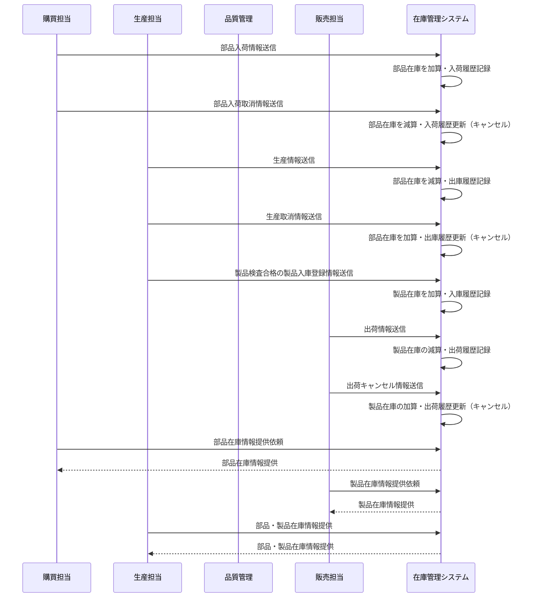

# システム設計書

## 概要

ドローン在庫管理システムのアーキテクチャとシステム設計に関するドキュメントです。

## アーキテクチャパターン

### API 中心設計

本プロジェクトは**API 中心の設計**を採用しています。外部システム（購買システム、生産管理システム、販売管理システム）からのリクエストを受けて在庫管理業務を処理する REST API サーバーです。

| レイヤ       | 技術                      | 説明                              |
| ------------ | ------------------------- | --------------------------------- |
| API 層       | Spring Boot（Spring Web） | REST API の提供、外部システム連携 |
| 通信         | HTTP/REST                 | 外部システムとの標準的な API 通信 |
| ドキュメント | OpenAPI（Swagger UI）     | API 仕様の可視化と試験            |

### API 中心設計の選択理由

1. **外部システム連携の重視**：購買・生産・販売システムとの効率的な情報連携
2. **システム間結合度の最小化**：標準的な REST API による疎結合アーキテクチャ
3. **拡張性の確保**：新しい外部システムとの連携が容易
4. **運用性の向上**：バッチ処理やイベント駆動による自動化対応

## システム構成

### 全体構成

#### システム構成

```
┌─────────────────┐                    ┌──────────────────────────────────────┐
│   外部システム    │                    │         在庫管理システム                │
├─────────────────┤                    ├──────────────────────────────────────┤
│                 │                    │                                      │
│ •購買システム     │◄──────────────────►│  ┌─────────────┐  ┌───────────────┐  │
│ •生産管理システム  │    REST API通信    │  │   API層      │  │  データ層      │  │
│ •販売システム     │                    │  │             │  │               │  │
│                 │                    │  │•REST API    │◄►│•MySQL DB      │  │
└─────────────────┘                    │  │•Spring Boot │  │•JPA/ORM       │  │
                                       │  │•認証・認可    │  │•トランザクション │ │
                                       │  └─────────────┘  └───────────────┘  │
                                       │                                      │
                                       └──────────────────────────────────────┘
```

#### システム間の関係



### 技術スタック

#### バックエンド

| 技術            | バージョン | 用途                           |
| --------------- | ---------- | ------------------------------ |
| Java            | 17         | メイン開発言語                 |
| Spring Boot     | 3.3.5      | アプリケーションフレームワーク |
| Spring Security | 6.x        | 認証・認可                     |
| Spring Data JPA | 3.x        | データベースアクセス           |
| MySQL           | 8.0+       | データベース                   |
| Maven           | 3.6+       | ビルドツール                   |
| OpenAPI 3       | 3.0.3      | API 仕様定義                   |

#### 開発・テストツール

| 技術                 | 用途           |
| -------------------- | -------------- |
| Spring Boot DevTools | ホットリロード |
| HTTP Client          | API テスト     |
| JUnit 5              | 単体テスト     |
| Testcontainers       | 統合テスト     |

### 2.2 システム構成要素

#### 2.2.1 API インターフェース層

- **外部システム連携 API**

  - RESTful API による標準的なインターフェース
  - 購買・生産・販売システムとの情報連携
  - JSON 形式のデータ交換
  - OpenAPI（Swagger）による API 仕様管理

#### 2.2.2 ビジネス層（アプリケーション層）

- **REST API サーバー**
  - Spring Boot によるマイクロサービス
  - REST Controller による API エンドポイント提供
  - Service Layer によるビジネスロジック実装
  - Spring Security による認証・認可制御

#### 2.2.3 データアクセス層

- **データアクセス制御**
  - Spring Data JPA による ORM
  - Repository パターンによるデータアクセス
  - HikariCP による接続プール管理
  - トランザクション管理

#### 2.2.4 データベース層

- **リレーショナルデータベース**
  - MySQL 8.0 による永続化
  - マスター・トランザクション・ログ系テーブル分離
  - インデックス最適化による高速検索
  - 外部キー制約による参照整合性保証

## セキュリティ設計

### 認証・認可アーキテクチャ

```
┌─────────────────┐     API Key       ┌─────────────────┐
│                │  ◄──────────────►  │                │
│  外部システム     │    / JWT Token    │  Spring Boot    │
│ (購買・生産・販売) │                   │     Backend     │
│                │     API Request    │                │
│ ・システム認証鍵  │  ◄──────────────►  │  ・API認証       │
│ ・トークン管理    │    + Auth Header   │  ・RBAC認可      │
└─────────────────┘                   │  ・IP制限        │
                                      └─────────────────┘
```

### API 認証・認可設計

#### 外部システム認証

1. **API キー認証**

   - 各外部システム（購買・生産・販売）に固有の API キーを発行
   - リクエストヘッダーに API キーを含めて認証
   - IP アドレス制限による追加セキュリティ

2. **JWT トークン認証**
   - 管理者がクレデンシャルを送信
   - サーバーが JWT トークンを生成・返却
   - 管理用 UI がローカルストレージに保存
   - 以降の管理 API リクエストに Authorization ヘッダーでトークンを送信

### セキュリティ実装

- **Spring Security**: 認証・認可フレームワーク
- **API キー認証**: 外部システム認証フィルター
- **JWT 認証フィルター**: 管理者認証（管理機能用）
- **IP アドレス制限**: 外部システムからのアクセス制限
- **入力値検証**: Bean Validation によるバリデーション
- **SQL インジェクション対策**: JPA/Hibernate による安全なクエリ実行
- **API レート制限**: 外部システムからの大量リクエスト制御

## 環境構成

### 必要な環境

- **Java 17**
- **Maven 3.6+**
- **MySQL 8.0+**

### 環境別構成

| 環境           | 目的           | 構成                   |
| -------------- | -------------- | ---------------------- |
| **開発環境**   | 開発・デバッグ | ローカル開発サーバー   |
| **テスト環境** | 結合テスト     | 本番類似環境           |
| **本番環境**   | サービス提供   | 冗長化・スケールアウト |

## 📋 承認履歴

| バージョン | 更新日     | 更新者           | 承認者         | 更新内容 |
| ---------- | ---------- | ---------------- | -------------- | -------- |
| 1.0.0      | 2024-12-15 | Development Team | UI/UX Designer | 初版作成 |

---

## 📚 関連ドキュメント

- [業務要件書](../requirements/business-requirements.md)
- [機能要件書](../requirements/functional-requirements.md)
- [システム概要書](./system-overview.md)
- [データ設計書](./data-design.md)
- [API 仕様書](../../api/docs/swagger/)

---
