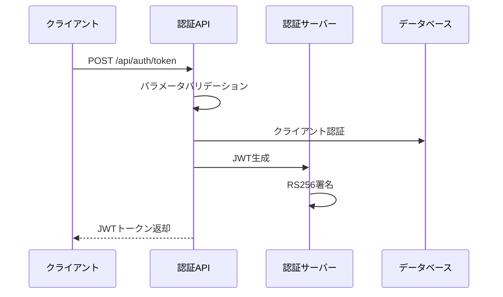

# API 仕様書（認証 API）

## 1. API 概要

| 項目           | 内容                                     |
| -------------- | ---------------------------------------- |
| **API 名**     | 認証 API                                 |
| **概要**       | JWT 認証トークンを発行する認証 API       |
| **利用者**     | 全システム（購買・生産・販売システム）   |
| **関連機能**   | アクセス認証、権限管理、セキュリティ管理 |
| **更新日**     | 2024 年 12 月 15 日                      |
| **バージョン** | 1.0.0                                    |

### 1.1 機能概要

- OAuth 2.0 Client Credentials Grant による認証
- JWT（JSON Web Token）の発行
- システム権限に基づくスコープ管理
- RS256 アルゴリズムによる電子署名

### 1.2 認証方式

- **OAuth 2.0 Client Credentials Grant**
- **JWT 形式**：RS256 署名アルゴリズム
- **有効期限**：24 時間

---

## 2. インターフェース仕様（IF 仕様）

### 2.1 基本情報

- **メソッド**：POST
- **URL**：`/api/auth/token`
- **認証方式**：Client Credentials
- **Content-Type**：application/json

### 2.2 リクエストボディ

```json
{
  "client_id": "purchase-client-001",
  "client_secret": "***",
  "grant_type": "client_credentials",
  "scope": "SYSTEM_BUYER"
}
```

#### 2.2.1 リクエストパラメータ

| パラメータ名  | 型     | 必須 | 説明                     | 制約                         |
| ------------- | ------ | ---- | ------------------------ | ---------------------------- |
| client_id     | string | ○    | クライアント ID          | 最大 50 文字                 |
| client_secret | string | ○    | クライアントシークレット | 最大 255 文字                |
| grant_type    | string | ○    | 認証方式（固定値）       | "client_credentials"のみ     |
| scope         | string | ○    | 要求するシステム権限     | SYSTEM_BUYER/PROD/SALES のみ |

### 2.3 レスポンス

#### 2.3.1 成功レスポンス（200 OK）

```json
{
  "access_token": "eyJhbGciOiJSUzI1NiIsInR5cCI6IkpXVCJ9...",
  "token_type": "Bearer",
  "expires_in": 86400,
  "scope": "SYSTEM_BUYER"
}
```

#### 2.3.2 エラーレスポンス

| ステータス | エラーコード    | 説明                 |
| ---------- | --------------- | -------------------- |
| 400        | INVALID_REQUEST | リクエスト形式不正   |
| 401        | INVALID_CLIENT  | クライアント認証失敗 |
| 400        | INVALID_SCOPE   | 無効なスコープ       |
| 500        | INTERNAL_ERROR  | システム内部エラー   |

---

## 3. 詳細設計（内部仕様）

### 3.1 処理フロー



### 3.2 JWT ペイロード構造

```json
{
  "iss": "drone-inventory-system",
  "sub": "PURCHASE_SYSTEM",
  "aud": "api.drone-inventory.local",
  "exp": 1671120000,
  "iat": 1671033600,
  "system_id": "PURCHASE_SYSTEM",
  "permissions": ["SYSTEM_BUYER"],
  "client_id": "purchase-client-001"
}
```

#### 3.2.1 JWT クレーム説明

| クレーム名  | 説明            | 例                          |
| ----------- | --------------- | --------------------------- |
| iss         | 発行者          | "drone-inventory-system"    |
| sub         | 主体            | "PURCHASE_SYSTEM"           |
| aud         | 対象者          | "api.drone-inventory.local" |
| exp         | 有効期限        | 1671120000 (UNIX 時刻)      |
| iat         | 発行時刻        | 1671033600 (UNIX 時刻)      |
| system_id   | システム ID     | "PURCHASE_SYSTEM"           |
| permissions | 権限リスト      | ["SYSTEM_BUYER"]            |
| client_id   | クライアント ID | "purchase-client-001"       |

### 3.3 システム権限レベル

| 権限レベル   | 対象システム | 実行可能操作                           |
| ------------ | ------------ | -------------------------------------- |
| SYSTEM_BUYER | 購買システム | 部品入荷、入荷取消、部品在庫照会       |
| SYSTEM_PROD  | 生産システム | 部品出庫、出庫取消、製品入庫、在庫照会 |
| SYSTEM_SALES | 販売システム | 製品出荷、出荷キャンセル、製品在庫照会 |

### 3.4 業務ルール

- **認証方式**：OAuth 2.0 Client Credentials Grant のみサポート
- **トークン有効期限**：24 時間（86400 秒）
- **署名アルゴリズム**：RS256（RSA 署名）
- **スコープ検証**：要求されたスコープとクライアントの権限を照合
- **レート制限**：クライアント別 60req/min

### 3.5 セキュリティ要件

- **通信暗号化**：TLS 1.2 以上必須
- **クライアント認証**：client_id と client_secret による認証
- **トークン署名**：RS256 アルゴリズムによる電子署名
- **キーローテーション**：公開鍵・秘密鍵ペアの定期的な更新（月次）
- **監査ログ**：全認証リクエストの記録

### 3.6 エラーハンドリング

| エラーケース         | HTTP Status | エラーコード    | 対応             |
| -------------------- | ----------- | --------------- | ---------------- |
| 無効な grant_type    | 400         | INVALID_REQUEST | パラメータエラー |
| クライアント認証失敗 | 401         | INVALID_CLIENT  | 認証失敗ログ出力 |
| 無効なスコープ       | 400         | INVALID_SCOPE   | スコープエラー   |
| JWT 生成失敗         | 500         | INTERNAL_ERROR  | システムエラー   |

### 3.7 パフォーマンス要件

- **レスポンス時間**：平均 100ms 以内
- **同時接続数**：200 接続
- **スループット**：2000 req/min
- **可用性**：99.9%以上

### 3.8 クライアント登録情報

#### システムクライアント一覧

| システム名   | client_id             | 権限         | 説明           |
| ------------ | --------------------- | ------------ | -------------- |
| 購買システム | purchase-client-001   | SYSTEM_BUYER | 部品購買管理   |
| 生産システム | production-client-001 | SYSTEM_PROD  | 製造・生産管理 |
| 販売システム | sales-client-001      | SYSTEM_SALES | 製品販売管理   |

### 3.9 関連ドキュメント

- [共通仕様書](./共通仕様書.md)
- [認証 API（OpenAPI 仕様）](./認証API.yaml)
- [セキュリティ要件書](../../要件定義/3.非機能要件.md)
- [システム概要書](./1.APIシステム概要.md)
