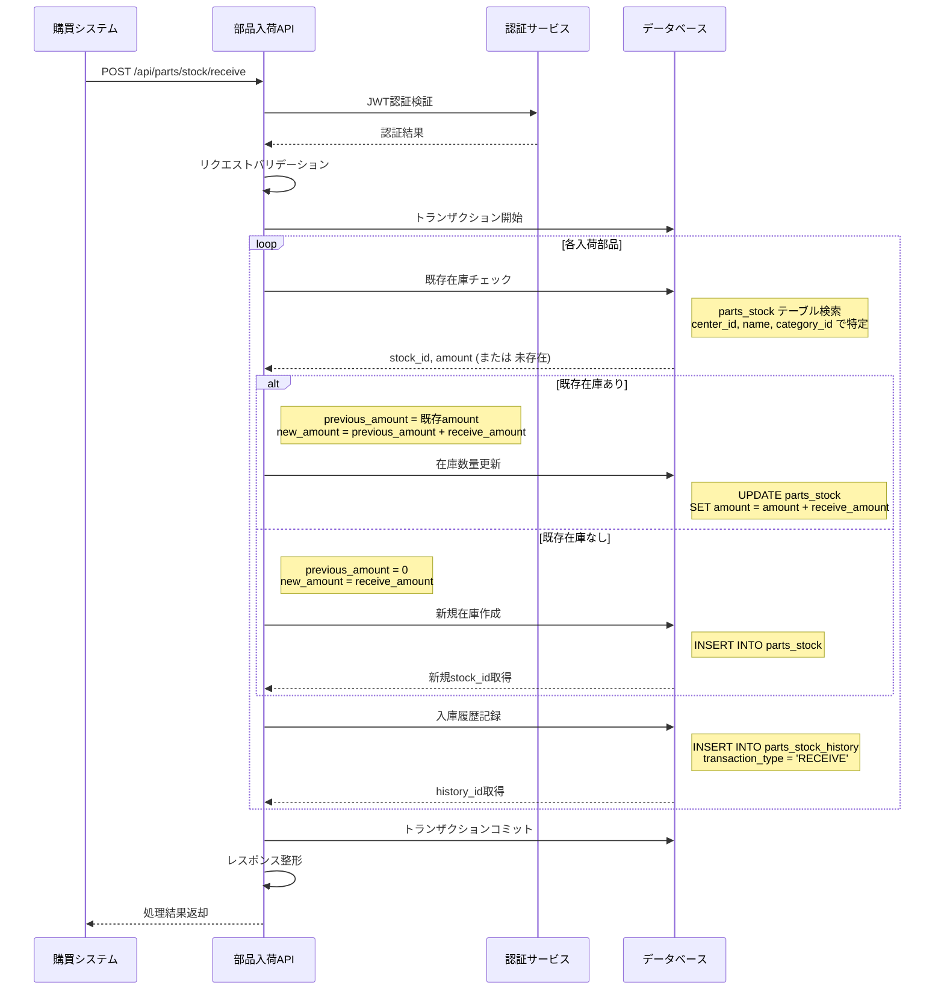

# API 仕様書（部品入荷 API）

## 1. API 概要

| 項目           | 内容                |
| -------------- | ------------------- |
| **API 名**     | 部品入荷 API        |
| **利用者**     | 購買システム        |
| **更新日**     | 2024 年 12 月 15 日 |
| **バージョン** | 1.0.0               |

### 1.1 機能概要

- 購買担当からの入荷情報連携の受信
- 部品在庫の更新（既存在庫の更新または新規在庫の追加登録）
- 入出荷履歴への入荷履歴の記録
- トランザクション制御による確実なデータ更新

---

## 2. インターフェース仕様（IF 仕様）

### 2.1 基本情報

- **メソッド**：POST
- **URL**：`/api/parts/stock/receive`
- **認証方式**：JWT Bearer 認証
- **リクエスト形式**：application/json
- **レスポンス形式**：application/json

### 2.2 リクエスト

#### 2.2.1 リクエスト例

```http
POST /api/parts/stock/receive
Authorization: Bearer <JWT_TOKEN>
Content-Type: application/json

{
  "receive_date": "2024-12-15T14:30:00Z",
  "center_id": 1,
  "supplier_name": "株式会社サプライヤーA",
  "purchase_order_no": "PO-2024-001234",
  "operator_name": "購買太郎",
  "items": [
    {
      "name": "ドローンフレーム（カーボン製）",
      "category_id": 1,
      "receive_amount": 50,
      "description": "カーボン製のドローンフレーム"
    },
    {
      "name": "ドローンプロペラ（高効率）",
      "category_id": 2,
      "receive_amount": 100,
      "description": "高効率ドローン用プロペラ"
    }
  ]
}
```

#### 2.2.2 リクエストヘッダー

| ヘッダー名    | 必須 | 説明             | 例                 |
| ------------- | ---- | ---------------- | ------------------ |
| Authorization | ○    | JWT 認証トークン | Bearer <JWT_TOKEN> |
| Content-Type  | ○    | コンテンツ種別   | application/json   |

#### 2.2.3 リクエストボディ

| フィールド名      | 型     | 必須 | 説明                 | 例                       |
| ----------------- | ------ | ---- | -------------------- | ------------------------ |
| receive_date      | string | ○    | 入荷日時（ISO 8601） | "2024-12-15T14:30:00Z"   |
| center_id         | number | ○    | 入荷先センター ID    | 1                        |
| supplier_name     | string | ○    | 仕入先名             | "株式会社サプライヤー A" |
| purchase_order_no | string | ○    | 発注書番号           | "PO-2024-001234"         |
| operator_name     | string | ○    | 入荷作業者名         | "購買太郎"               |
| items             | array  | ○    | 入荷部品リスト       | 下記 items 仕様参照      |

##### items 配列の仕様

| フィールド名   | 型     | 必須 | 説明        | 例                               |
| -------------- | ------ | ---- | ----------- | -------------------------------- |
| name           | string | ○    | 部品名      | "ドローンフレーム（カーボン製）" |
| category_id    | number | ○    | カテゴリ ID | 1                                |
| receive_amount | number | ○    | 入荷数量    | 50                               |
| description    | string | 任意 | 部品説明    | "カーボン製のドローンフレーム"   |

### 2.3 レスポンス

#### 2.3.1 成功レスポンス（200 OK）

```json
{
  "status": "success",
  "message": "部品入荷処理が正常に完了しました",
  "data": {
    "receive_date": "2024-12-15T14:30:00Z",
    "center_name": "メインセンター",
    "total_items": 2,
    "processed_items": [
      {
        "name": "ドローンフレーム（カーボン製）",
        "stock_id": 1,
        "action": "updated",
        "previous_amount": 75,
        "receive_amount": 50,
        "new_amount": 125
      },
      {
        "name": "ドローンプロペラ（高効率）",
        "stock_id": 2,
        "action": "created",
        "previous_amount": 0,
        "receive_amount": 100,
        "new_amount": 100
      }
    ],
    "history_ids": [501, 502]
  }
}
```

#### 2.3.2 エラーレスポンス

| ステータス | エラーコード            | 説明                       |
| ---------- | ----------------------- | -------------------------- |
| 400        | INVALID_REQUEST         | リクエストパラメータエラー |
| 400        | INVALID_CHARACTER       | 不正文字列・文字種エラー   |
| 400        | SECURITY_VIOLATION      | セキュリティチェックエラー |
| 400        | BUSINESS_RULE_VIOLATION | ビジネスルール違反         |
| 401        | UNAUTHORIZED            | 認証エラー                 |
| 404        | CENTER_NOT_FOUND        | センター ID が存在しない   |
| 404        | CATEGORY_NOT_FOUND      | カテゴリ ID が存在しない   |
| 409        | DUPLICATE_ORDER         | 発注書番号が重複           |
| 500        | INTERNAL_ERROR          | システム内部エラー         |

##### エラーレスポンス例

**基本的なパラメータエラー**

```json
{
  "status": "error",
  "error_code": "INVALID_REQUEST",
  "message": "リクエストパラメータに不正な値が含まれています",
  "details": {
    "field": "items[0].receive_amount",
    "value": -10,
    "reason": "入荷数量は1以上である必要があります"
  }
}
```

**不正文字列エラー**

```json
{
  "status": "error",
  "error_code": "INVALID_CHARACTER",
  "message": "入力値に許可されていない文字が含まれています",
  "details": {
    "field": "supplier_name",
    "reason": "会社名には日本語、英数字、および限定された記号のみ使用可能です"
  }
}
```

**セキュリティ違反エラー**

```json
{
  "status": "error",
  "error_code": "SECURITY_VIOLATION",
  "message": "セキュリティポリシーに違反する入力が検出されました",
  "details": {
    "field": "name",
    "reason": "不正なスクリプトまたはコマンドが検出されました"
  }
}
```

**ビジネスルール違反エラー**

```json
{
  "status": "error",
  "error_code": "BUSINESS_RULE_VIOLATION",
  "message": "業務ルールに違反する値が指定されています",
  "details": {
    "field": "items[0].receive_amount",
    "value": 15000,
    "reason": "1回の入荷数量は10,000個以下である必要があります"
  }
}
```

---

## 3. 詳細設計（内部仕様）

### 3.1 処理フロー



### 3.2 バリデーションルール

#### 3.2.1 必須項目チェック（400 エラー）

- **receive_date**: 未指定または空文字列の場合エラー
- **center_id**: 未指定または数値以外の場合エラー
- **supplier_name**: 未指定または空文字列の場合エラー
- **purchase_order_no**: 未指定または空文字列の場合エラー
- **operator_name**: 未指定または空文字列の場合エラー
- **items**: 未指定または空配列の場合エラー

#### 3.2.2 データ形式チェック（400 エラー）

- **receive_date**: ISO 8601 形式以外の場合エラー
  - 例: `"2024/12/15"` → 400 エラー
- **center_id**: 正の整数以外の場合エラー
  - 例: `"abc"`, `0`, `-1` → 400 エラー
- **receive_amount**: 正の整数以外の場合エラー
  - 例: `0`, `-10`, `"abc"` → 400 エラー

#### 3.2.3 データ長チェック（400 エラー）

- **supplier_name**: 100 文字超過の場合エラー
- **purchase_order_no**: 50 文字超過の場合エラー
- **operator_name**: 50 文字超過の場合エラー
- **name**: 255 文字超過の場合エラー
- **description**: 255 文字超過の場合エラー

#### 3.2.4 存在チェック

- **center_id**: 存在しないセンター ID の場合 `CENTER_NOT_FOUND` エラー（404）
  ```sql
  SELECT center_id FROM center_info
  WHERE center_id = :center_id AND delete_flag = 0
  ```
- **category_id**: 存在しないカテゴリ ID の場合 `CATEGORY_NOT_FOUND` エラー（404）
  ```sql
  SELECT category_id FROM parts_category_info
  WHERE category_id = :category_id AND delete_flag = 0
  ```

#### 3.2.5 文字種・セキュリティチェック（400 エラー）

##### 禁止文字列チェック

- **全文字列フィールド**: SQL インジェクション対策
  - 禁止文字列: `'`, `"`, `;`, `--`, `/*`, `*/`, `<script>`, `</script>`
  - 例: `"'; DROP TABLE--"` → 400 エラー
- **HTML タグチェック**: XSS 攻撃対策
  - 禁止パターン: `<`, `>`, `&lt;`, `&gt;`
  - 例: `"<script>alert('XSS')</script>"` → 400 エラー

##### 制御文字チェック

- **全文字列フィールド**: 制御文字（改行、タブ、NULL 文字等）の除去
  - 除去対象: `\n`, `\r`, `\t`, `\0`, `\x01-\x1F`, `\x7F-\x9F`
  - 処理: 検出時は自動除去（エラーではなく正規化）

##### 文字種制限

- **supplier_name**: 日本語（ひらがな、カタカナ、漢字）、英数字、記号（株式会社、（）、－、.、スペース）のみ
- **purchase_order_no**: 英数字、ハイフン（-）、アンダースコア（\_）のみ
- **operator_name**: 日本語（ひらがな、カタカナ、漢字）、英数字、スペースのみ
- **name**: 日本語（ひらがな、カタカナ、漢字）、英数字、記号（（）、－、.、スペース）のみ
- **description**: 日本語（ひらがな、カタカナ、漢字）、英数字、一般的な記号のみ

##### 文字正規化

- **全角半角統一**: 英数字は半角に統一
- **空白正規化**: 先頭末尾の空白除去、連続空白の単一化
- **カタカナ統一**: 全角カタカナに統一

#### 3.2.6 ビジネスルールチェック（400 エラー）

##### 業務制約チェック

- **receive_amount**: 1 回の入荷数量上限チェック（10,000 個以下）
- **name**: 同一カテゴリ内での部品名重複チェック（警告レベル）
- **supplier_name**: 登録済み仕入先名との照合（新規の場合は警告ログ出力）

#### 3.2.7 重複チェック

- **purchase_order_no**: 既に処理済みの発注書番号の場合 `DUPLICATE_ORDER` エラー（409）
  ```sql
  SELECT COUNT(*) FROM parts_stock_history
  WHERE purchase_order_no = :purchase_order_no
    AND delete_flag = 0
  ```

### 3.3 在庫更新処理

#### 3.3.1 既存在庫の特定と数量取得

以下の条件で既存在庫を検索し、**変更前数量を保持**します：

```sql
SELECT stock_id, amount AS previous_amount
FROM parts_stock
WHERE center_id = :center_id
  AND name = :name
  AND category_id = :category_id
  AND delete_flag = 0
LIMIT 1
```

**重要事項**:

- この時点で取得した`previous_amount`を変数に保存し、履歴記録で使用
- データ要件.md のテーブル定義に完全準拠
- `delete_flag = 0`による論理削除考慮

#### 3.3.2 在庫更新処理

##### 既存在庫がある場合（更新）

```sql
-- Step 1: 変更前数量を保持済み（3.3.1で取得）
-- previous_amount = 既存の amount 値

-- Step 2: 在庫数量を更新
UPDATE parts_stock
SET amount = amount + :receive_amount,
    update_date = CURRENT_TIMESTAMP
WHERE stock_id = :stock_id
  AND delete_flag = 0

-- Step 3: 変更後数量を計算
-- new_amount = previous_amount + receive_amount
```

##### 既存在庫がない場合（新規追加）

```sql
-- Step 1: 新規在庫を追加
INSERT INTO parts_stock (
    category_id, name, center_id,
    amount, description, create_date, update_date
) VALUES (
    :category_id, :name, :center_id,
    :receive_amount, :description, CURRENT_TIMESTAMP, CURRENT_TIMESTAMP
)

-- Step 2: 新規追加されたstock_idを取得
SELECT LAST_INSERT_ID() AS stock_id

-- Step 3: 履歴記録用の数量設定
-- previous_amount = 0 (新規のため)
-- new_amount = receive_amount
```

### 3.4 入出庫履歴記録

各入荷部品に対して parts_stock_history テーブルに履歴を記録します。**3.3 で取得・計算した数量情報を使用**します：

#### 3.4.1 履歴記録に必要な数量情報

| 項目              | 取得方法       | 既存在庫の場合                 | 新規在庫の場合 |
| ----------------- | -------------- | ------------------------------ | -------------- |
| **amount_before** | 3.3.1 で取得   | 既存の amount 値               | 0              |
| **amount_change** | リクエストから | receive_amount                 | receive_amount |
| **amount_after**  | 計算           | amount_before + receive_amount | receive_amount |

#### 3.4.2 履歴記録 SQL

```sql
INSERT INTO parts_stock_history (
    stock_id, transaction_type, transaction_date,
    amount_before, amount_change, amount_after,
    supplier_name, purchase_order_no, operator_name, remarks,
    create_date, update_date
) VALUES (
    :stock_id, 'RECEIVE', :receive_date,
    :amount_before, :amount_change, :amount_after,
    :supplier_name, :purchase_order_no, :operator_name, '部品入荷',
    CURRENT_TIMESTAMP, CURRENT_TIMESTAMP
)
```

#### 3.4.3 実際の値の例

**既存在庫更新の場合**：

```
amount_before = 75 (3.3.1で取得)
amount_change = 50 (リクエストから)
amount_after = 125 (75 + 50)
```

**新規在庫追加の場合**：

```
amount_before = 0 (新規のため)
amount_change = 100 (リクエストから)
amount_after = 100 (0 + 100)
```

### 3.5 レスポンス構築処理

#### 3.5.1 センター名取得

```sql
SELECT center_name
FROM center_info
WHERE center_id = :center_id
  AND delete_flag = 0
```

#### 3.5.2 処理結果の整形

レスポンスの data 部分は以下の情報で構成：

```json
{
  "receive_date": "リクエストのreceive_date",
  "center_name": "SQLで取得したcenter_name",
  "total_items": "処理した部品数",
  "processed_items": [
    {
      "name": "部品名",
      "stock_id": "在庫ID（新規の場合はINSERT後に取得）",
      "action": "updated または created",
      "previous_amount": "amount_before",
      "receive_amount": "amount_change",
      "new_amount": "amount_after"
    }
  ],
  "history_ids": ["履歴ID配列"]
}
```

### 3.6 エラーハンドリング

この API で使用するエラーコードは[共通仕様書（4.4 エラーコード一覧）](<../共通/API仕様(共通).md#44-エラーコード一覧>)を参照してください。

**本 API で発生する可能性のあるエラー**：

- `INVALID_REQUEST` (400) - リクエストパラメータ不正（形式、必須項目、データ長など）
- `INVALID_CHARACTER` (400) - 不正文字列・文字種エラー（許可されていない文字の使用）
- `SECURITY_VIOLATION` (400) - セキュリティチェックエラー（SQL インジェクション、XSS 等の検出）
- `BUSINESS_RULE_VIOLATION` (400) - ビジネスルール違反（数量上限、業務制約等）
- `UNAUTHORIZED` (401) - JWT 認証失敗
- `CENTER_NOT_FOUND` (404) - センター ID が存在しない
- `CATEGORY_NOT_FOUND` (404) - カテゴリ ID が存在しない
- `DUPLICATE_ORDER` (409) - 発注書番号重複
- `INTERNAL_ERROR` (500) - システム内部エラー

### 3.7 データ更新仕様

#### 3.7.1 更新対象テーブル

本 API は以下のテーブルを更新します（データ要件.md 準拠）：

| テーブル名              | 役割                   | 更新内容                             |
| ----------------------- | ---------------------- | ------------------------------------ |
| **parts_stock**         | 部品在庫テーブル       | 在庫数量の更新または新規レコード追加 |
| **parts_stock_history** | 部品入出庫履歴テーブル | 入荷履歴の新規記録                   |

#### 3.7.2 トランザクション制御

```sql
-- トランザクション開始
START TRANSACTION;

-- 各部品の処理（複数件の場合はループ）
-- 1. 既存在庫チェック
-- 2. 在庫更新/新規作成
-- 3. 履歴記録

-- 全処理成功時
COMMIT;

-- エラー発生時
ROLLBACK;
```

**制御方針**：

- 全ての在庫更新と履歴記録を 1 つのトランザクションで処理
- いずれかの処理でエラーが発生した場合、全ての処理をロールバック
- 成功時のみコミットを実行
- デッドロック対策として処理順序を固定化

### 3.8 パフォーマンス考慮事項

#### 3.8.1 インデックス活用

必要なインデックス（データ要件.md に基づく）：

```sql
-- parts_stock テーブル
CREATE INDEX idx_parts_stock_lookup ON parts_stock (center_id, name, category_id, delete_flag);
CREATE INDEX idx_parts_stock_center ON parts_stock (center_id, delete_flag);

-- parts_stock_history テーブル
CREATE INDEX idx_parts_history_stock ON parts_stock_history (stock_id, create_date);
CREATE INDEX idx_parts_history_po ON parts_stock_history (purchase_order_no, delete_flag);

-- center_info テーブル
CREATE INDEX idx_center_active ON center_info (center_id, delete_flag);

-- parts_category_info テーブル
CREATE INDEX idx_category_active ON parts_category_info (category_id, delete_flag);
```

#### 3.8.2 バッチ処理最適化

大量データ処理時の考慮事項：

- 1 回の API コールでの処理件数上限：100 件
- 長時間トランザクション回避のためのタイムアウト設定：30 秒
- メモリ使用量制限：処理データ保持は最小限

### 3.9 関連ドキュメント

- [データ要件書](../../共通/データ要件.md)
- [共通仕様書](<../共通/API仕様(共通).md>)
- [部品在庫照会 API](./部品在庫照会API.md)
- [システム概要書](../共通/APIシステム概要.md)
