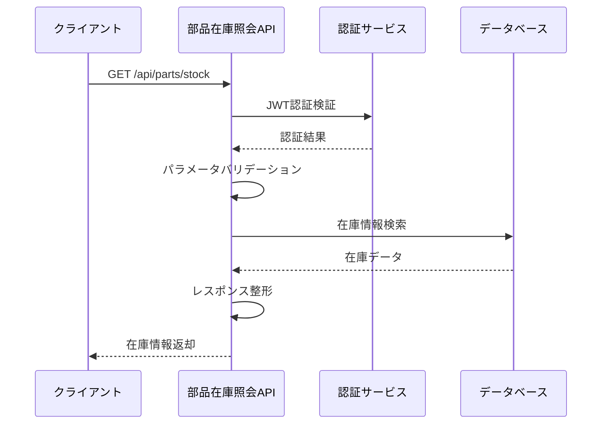

# API 仕様書（部品在庫照会 API）

## 1. API 概要

| 項目           | 内容                       |
| -------------- | -------------------------- |
| **API 名**     | 部品在庫照会 API           |
| **利用者**     | 購買システム、生産システム |
| **更新日**     | 2024 年 12 月 15 日        |
| **バージョン** | 1.0.0                      |

### 1.1 機能概要

- 部品在庫情報の照会(複雑な条件による柔軟な取得)
- リアルタイム在庫情報の提供

---

## 2. インターフェース仕様（IF 仕様）

### 2.1 基本情報

- **メソッド**：GET
- **URL**：`/api/parts/stock`
- **認証方式**：JWT Bearer 認証
- **レスポンス形式**：application/json

### 2.2 リクエスト

#### 2.2.1 リクエスト例

```http
GET /api/parts/stock?center_ids=1,2&category_ids=1,3&name_pattern=ドローン&amount_min=10&amount_max=100
Authorization: Bearer <JWT_TOKEN>
```

#### 2.2.2 リクエストヘッダー

| ヘッダー名    | 必須 | 説明             | 例                 |
| ------------- | ---- | ---------------- | ------------------ |
| Authorization | ○    | JWT 認証トークン | Bearer <JWT_TOKEN> |

#### 2.2.3 クエリパラメータ

| パラメータ名 | 型      | 必須 | 説明                         | 例                     |
| ------------ | ------- | ---- | ---------------------------- | ---------------------- |
| center_ids   | string  | 任意 | センター ID（カンマ区切り）  | "1,2"                  |
| category_ids | string  | 任意 | カテゴリ ID（カンマ区切り）  | "1,3"                  |
| stock_id     | string  | 任意 | 在庫 ID（カンマ区切り）      | "1"                    |
| name_pattern | string  | 任意 | 部品名の部分一致検索         | "ドローン"             |
| amount_min   | integer | 任意 | 在庫数量の最小値             | 10                     |
| amount_max   | integer | 任意 | 在庫数量の最大値             | 100                    |
| date_from    | string  | 任意 | 更新日時の開始日（ISO 8601） | "2024-12-01T00:00:00Z" |
| date_to      | string  | 任意 | 更新日時の終了日（ISO 8601） | "2024-12-15T23:59:59Z" |

**注意**: GET メソッドのためリクエストボディはありません。

### 2.4 レスポンス

#### 2.4.1 成功レスポンス（200 OK）

```json
{
  "status": "success",
  "message": "部品在庫情報を正常に取得しました",
  "data": {
    "items": [
      {
        "stock_id": 1,
        "name": "ドローンフレーム（カーボン製）",
        "category_name": "フレーム",
        "center_name": "メインセンター",
        "amount": 75,
        "description": "カーボン製のドローンフレーム",
        "create_date": "2024-12-15T10:30:15Z",
        "update_date": "2024-12-15T14:20:30Z"
      },
      {
        "stock_id": 2,
        "name": "ドローンプロペラ（高効率）",
        "category_name": "プロペラ",
        "center_name": "メインセンター",
        "amount": 120,
        "description": "高効率ドローン用プロペラ",
        "create_date": "2024-12-14T09:15:30Z",
        "update_date": "2024-12-15T11:45:20Z"
      },
      {
        "stock_id": 5,
        "name": "ドローンバッテリー（リチウム）",
        "category_name": "バッテリー",
        "center_name": "西部センター",
        "amount": 45,
        "description": "長時間駆動リチウムバッテリー",
        "create_date": "2024-12-13T14:22:10Z",
        "update_date": "2024-12-15T16:30:45Z"
      }
    ],
    "total_count": 3
  }
}
```

#### 2.4.2 エラーレスポンス

| ステータス | エラーコード    | 説明               |
| ---------- | --------------- | ------------------ |
| 400        | INVALID_REQUEST | パラメータエラー   |
| 401        | UNAUTHORIZED    | 認証エラー         |
| 500        | INTERNAL_ERROR  | システム内部エラー |

---

## 3. 詳細設計（内部仕様）

### 3.1 処理フロー



### 3.2 パラメータの使い方

##### ID 系絞り込み（OR 条件）

- **center_ids**: 指定されたセンター ID のいずれかに一致する在庫を検索
  - 例: `center_ids=1,2` → center_id が 1 または 2 の在庫
- **category_ids**: 指定されたカテゴリ ID のいずれかに一致する在庫を検索
  - 例: `category_ids=1,3` → category_id が 1 または 3 の在庫
- **stock_id**: 指定された在庫 ID のいずれかに一致する在庫を検索
  - 例: `stock_id=1,5,10` → stock_id が 1、5、または 10 の在庫

##### 文字列検索

- **name_pattern**: 部品名（name）に対する部分一致検索（大文字小文字区別なし）
  - 例: `name_pattern=ドローン` → 部品名に「ドローン」を含む在庫

##### 数値範囲検索

- **amount_min**: 在庫数量が指定値以上の在庫を検索
  - 例: `amount_min=10` → 在庫数量 >= 10
- **amount_max**: 在庫数量が指定値以下の在庫を検索
  - 例: `amount_max=100` → 在庫数量 <= 100
- **範囲指定**: 最小値と最大値の両方を指定可能
  - 例: `amount_min=10&amount_max=100` → 10 <= 在庫数量 <= 100

##### 日時範囲検索

- **date_from**: 更新日時が指定日時以降の在庫を検索
  - 例: `date_from=2024-12-01T00:00:00Z` → update_date >= 2024-12-01T00:00:00Z
- **date_to**: 更新日時が指定日時以前の在庫を検索
  - 例: `date_to=2024-12-15T23:59:59Z` → update_date <= 2024-12-15T23:59:59Z
- **範囲指定**: 開始日時と終了日時の両方を指定可能
  - 例: `date_from=2024-12-01T00:00:00Z&date_to=2024-12-15T23:59:59Z`

##### 複数条件の組み合わせ

すべての指定されたパラメータは **AND 条件** で組み合わされます。

**例**: `center_ids=1,2&category_ids=1,3&amount_min=10`

- (center_id が 1 または 2) **AND** (category_id が 1 または 3) **AND** (在庫数量 >= 10)

##### バリデーションルール

###### パラメータ形式チェック（400 エラー）

- **数値パラメータ**: 整数以外の値は `INVALID_REQUEST` エラー
  - 例: `amount_min=abc` → 400 エラー
- **日時パラメータ**: ISO 8601 形式以外は `INVALID_REQUEST` エラー
  - 例: `date_from=2024/12/01` → 400 エラー
- **ID 形式**: カンマ区切りで数値以外が含まれる場合は `INVALID_REQUEST` エラー
  - 例: `center_ids=1,abc,3` → 400 エラー

###### 論理チェック（400 エラー）

- **範囲指定**: 最小値 > 最大値の場合は `INVALID_REQUEST` エラー
  - 例: `amount_min=100&amount_max=10` → 400 エラー
  - 例: `date_from=2024-12-15&date_to=2024-12-01` → 400 エラー

###### 存在チェック（正常系）

- **存在しない ID**: テーブルに存在しない ID が指定された場合は **正常系** として扱う
  - 例: `center_ids=999`（存在しないセンター） → 200 OK、結果 0 件
  - 例: `category_ids=888`（存在しないカテゴリ） → 200 OK、結果 0 件
  - **理由**: 外部システムが ID の存在を事前に知る必要がなく、柔軟な検索が可能

###### その他

- **空文字列**: パラメータに空文字列が指定された場合は無視される
  - 例: `name_pattern=` → パラメータ指定なしと同じ扱い

### 3.3 エラーハンドリング

この API で使用するエラーコードは[共通仕様書（4.4 エラーコード一覧）](<../共通/API仕様(共通).md#44-エラーコード一覧>)を参照してください。

**本 API で発生する可能性のあるエラー**：

- `INVALID_REQUEST` (400) - クエリパラメータの形式不正
- `UNAUTHORIZED` (401) - JWT 認証失敗
- `INTERNAL_ERROR` (500) - システム内部エラー

### 3.4 データ参照仕様

#### 参照テーブル

本 API は以下のテーブルからデータを取得します：

| テーブル名              | 役割                 | 参照項目                                                      |
| ----------------------- | -------------------- | ------------------------------------------------------------- |
| **parts_stock**         | 部品在庫マスター     | stock_id, name, amount, description, create_date, update_date |
| **parts_category_info** | 部品カテゴリマスター | category_name                                                 |
| **center_info**         | センターマスター     | center_name                                                   |

#### データ取得方式

```sql
-- 基本的なJOIN構造
SELECT
    ps.stock_id,
    ps.name,
    pc.category_name,
    ci.center_name,
    ps.amount,
    ps.description,
    ps.create_date,
    ps.update_date
FROM parts_stock ps
LEFT JOIN parts_category_info pc ON ps.category_id = pc.category_id
LEFT JOIN center_info ci ON ps.center_id = ci.center_id
WHERE ps.delete_flag = 0
  AND pc.delete_flag = 0
  AND ci.delete_flag = 0
  [AND 各種検索条件]
```

**注記**: 各テーブルの詳細定義は[データ要件書](../../共通/データ要件.md)を参照してください。

### 3.5 関連ドキュメント

- [共通仕様書](../共通仕様書.md)
- [部品在庫照会 API（OpenAPI 仕様）](./部品在庫照会API.yaml)
- [システム概要書](../../1.APIシステム概要.md)
- [データ設計書](../../../共通/2.データ要件.md)
